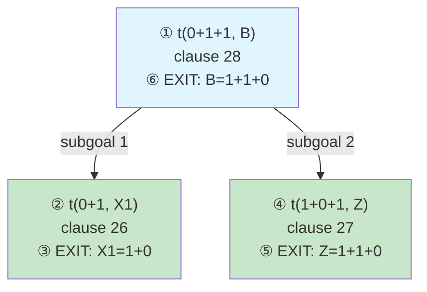
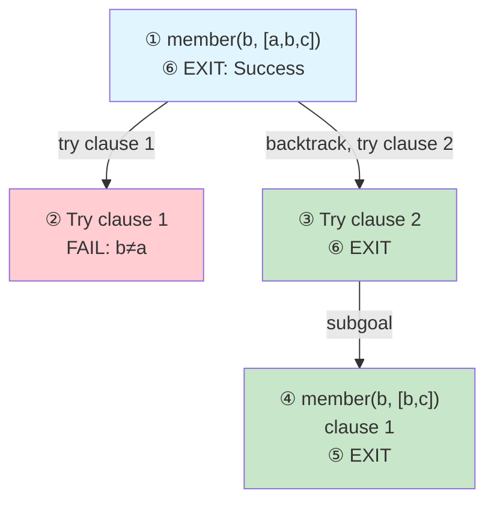
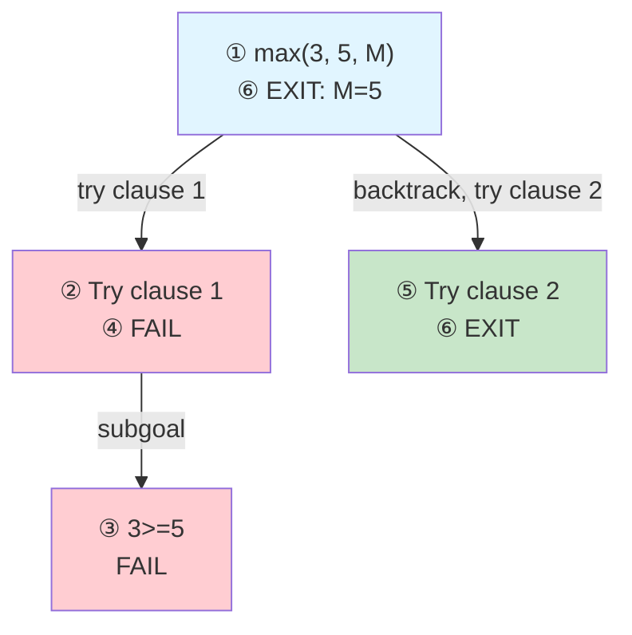
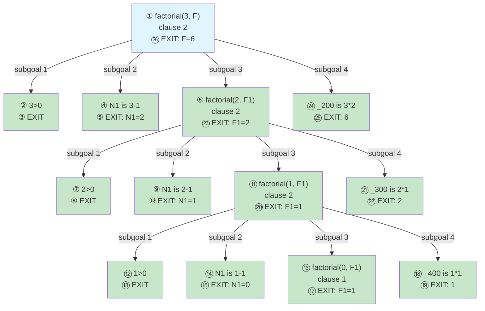
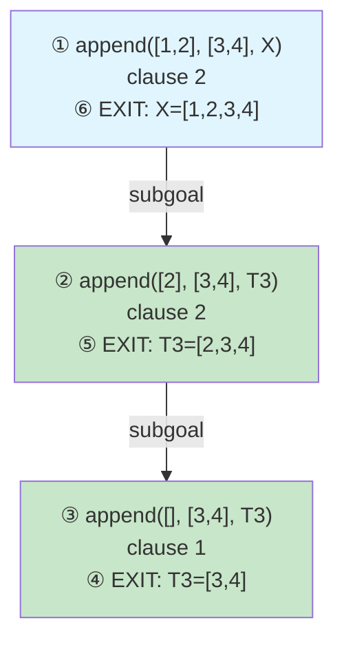

# Design Document

## Overview

This document describes the design for a dual-format Prolog trace visualization system. The system generates two complementary views from Prolog execution traces:

1. **Execution Timeline**: A flat, sequential walkthrough showing every CALL, EXIT, REDO, and FAIL event with full details
2. **Call Tree**: A hierarchical Mermaid diagram showing the structure of goal calls and their relationships

The design prioritizes reliability by using only data directly captured from Prolog's tracer hooks, avoiding all heuristics and guesswork.

## Architecture

### High-Level Flow

```
Prolog Source File + Query
         ↓
    Tracer Wrapper Generation
         ↓
    SWI-Prolog Execution with Tracer
         ↓
    JSON Trace Events
         ↓
    ┌─────────────────┐
    │  Event Parser   │
    └─────────────────┘
         ↓
    ┌─────────────────┐
    │ Timeline Builder│
    └─────────────────┘
         ↓
    ┌─────────────────┐
    │  Tree Builder   │
    └─────────────────┘
         ↓
    ┌─────────────────┐
    │ Markdown Formatter│
    └─────────────────┘
         ↓
    Final Markdown Output
```

### Component Responsibilities

1. **Tracer (tracer.pl)**: Captures execution events via `prolog_trace_interception/4` and exports as JSON
2. **Event Parser**: Parses JSON trace events into structured data
3. **Timeline Builder**: Constructs flat execution timeline from events
4. **Tree Builder**: Constructs hierarchical call tree from events
5. **Unification Extractor**: Compares CALL vs EXIT goals to extract bindings
6. **Markdown Formatter**: Generates final markdown with both visualizations

## Components and Interfaces

### Trace Event Structure

From the tracer, each event contains:

```
{
  "port": "call" | "exit" | "redo" | "fail",
  "level": number,              // Stack depth
  "goal": string,               // Goal with current bindings
  "predicate": string,          // Name/arity (e.g., "t/2")
  "arguments": [...],           // Present on exit
  "clause": {                   // Present when clause matched
    "head": string,
    "body": string,
    "line": number
  }
}
```

### Timeline Step Structure

```
interface TimelineStep {
  stepNumber: number;
  port: 'call' | 'exit' | 'redo' | 'fail';
  level: number;
  goal: string;
  clause?: {
    head: string;
    body: string;
    line: number;
  };
  unifications: Array<{
    variable: string;
    value: string;
  }>;
  subgoals: Array<{
    label: string;          // e.g., "[1.1]", "[1.2]"
    goal: string;
  }>;
  subgoalLabel?: string;    // e.g., "[1.1]" - which subgoal this step is solving
  returnsTo?: number;       // For EXIT: which CALL step
  note?: string;            // Additional context
  nextSubgoal?: string;     // e.g., "Subgoal [1.2]" - what comes next
}
```

### Tree Node Structure

```
interface TreeNode {
  id: string;                   // e.g., "A", "B", "C", ..., "Z", "AA", "AB", "AC"
  goal: string;
  clauseNumber?: string;        // e.g., "26", "26.1", "26.2" (line.index for multiple clauses on same line)
  callStep: number;
  exitStep?: number;
  status: 'success' | 'failure' | 'pending';
  children: TreeNode[];
  finalBinding?: string;
}
```

**Node ID Generation:**
- First 26 nodes: A-Z
- After Z: AA, AB, AC, ..., AZ, BA, BB, BC, ...
- Algorithm: `index < 26 ? char(65+index) : char(65+floor(index/26)-1) + char(65+(index%26))`

## Data Models

### Original Query Preservation

The original query string must be preserved before Prolog's tracer mangles variable names:

```
interface QueryContext {
  originalQuery: string;        // e.g., "t(0+1+1, B)"
  mangledQuery: string;         // e.g., "t(0+1+1, _8856)"
  queryVariables: string[];     // e.g., ["B"]
}
```

This allows us to display source variable names in the first match box and final answer.

### Call Stack Tracking

To build both timeline and tree, we maintain a call stack:

```
interface StackFrame {
  level: number;
  callStep: number;
  callEvent: TraceEvent;
  treeNode: TreeNode;
  children: TreeNode[];
}
```

The stack is indexed by level for O(1) lookup.

### Unification Extraction

Unifications are extracted by comparing CALL and EXIT goals:

```
CALL: t(0+1, _8822)
EXIT: t(0+1, 1+0)
Result: _8822 = 1+0
```

Algorithm:
1. Parse both goals into predicate + arguments
2. Match arguments positionally
3. For each position, if CALL has variable and EXIT has value, record binding
4. Handle complex terms recursively

### Subgoal Extraction

Subgoals are extracted from clause body:

```
Clause: t(X+1+1, Z) :- t(X+1, X1), t(X1+1, Z)
Body: "t(X+1, X1), t(X1+1, Z)"
Subgoals: ["t(X+1, X1)", "t(X1+1, Z)"]
```

Algorithm:
1. Split body on commas (respecting parentheses depth)
2. Substitute known bindings from pattern match
3. Return list of subgoals in execution order

### Clause Numbering

When multiple clauses exist on the same line, use dot notation:

```
Line 26: clause1. clause2. clause3.
Numbering: 26.1, 26.2, 26.3
```

Algorithm:
1. Group clauses by line number
2. Within each line, assign sequential index starting from 1
3. Format as "line.index" (e.g., "26.1")
4. For single clause on a line, use just line number (e.g., "26")

### Depth Limiting

To prevent infinite loops and manage large traces:

```
interface DepthConfig {
  maxDepth: number;             // Default: 100
  currentDepth: number;
  truncated: boolean;
}
```

When depth limit is reached:
1. Stop processing further trace events
2. Mark timeline as truncated
3. Add note: "Trace truncated at depth N"

### Multiple Solutions

The tool generates visualization for the first solution only:
- Process events until first successful EXIT of root query
- Ignore any REDO events on the root query
- Note in output: "Showing first solution only"

## Correctness Properties

*A property is a characteristic or behaviour that should hold true across all valid executions of a system—essentially, a formal statement about what the system should do. Properties serve as the bridge between human-readable specifications and machine-verifiable correctness guarantees.*

### Property 1: Timeline Completeness

*For any* trace event sequence, the timeline should contain exactly one step for each non-system event in the trace.

**Validates: Requirements 2.1, 2.2, 2.3, 2.4, 2.5**

### Property 2: Step Number Consistency

*For any* CALL event at step N, if it has a corresponding EXIT at step M, then the EXIT step should reference step N as its return point.

**Validates: Requirements 7.1, 7.2, 7.3, 7.7**

### Property 3: Tree Structure Validity

*For any* call tree, every non-root node should have exactly one parent, and the parent-child relationships should match the call stack nesting from the trace.

**Validates: Requirements 3.1, 3.3, 1.6**

### Property 4: Unification Correctness

*For any* CALL-EXIT pair, the extracted unifications should be derivable by structural comparison of the two goals.

**Validates: Requirements 4.1, 4.2, 4.3, 4.4**

### Property 5: Subgoal Ordering

*For any* clause with body goals, the subgoals listed in the timeline should appear in the same order as in the clause body.

**Validates: Requirements 6.2, 6.3**

### Property 6: Cross-Reference Validity

*For any* tree node with call step N and exit step M, both steps N and M should exist in the timeline.

**Validates: Requirements 7.4, 7.5, 7.6**

### Property 7: No Heuristics

*For any* visualization element (unification, clause match, subgoal), the information should be directly extractable from trace events without pattern matching or guessing.

**Validates: Requirements 12.1, 12.2, 12.3, 12.4, 12.5, 12.6, 12.7**

### Property 8: Depth Limit Enforcement

*For any* trace with depth exceeding the configured maximum, the timeline should stop at the depth limit and indicate truncation.

**Validates: Requirements 15.6, 15.7, 15.8**

### Property 9: Original Query Preservation

*For any* query, the original query string with source variable names should be preserved and used in the final output.

**Validates: Requirements 2.8**

### Property 10: Node ID Uniqueness

*For any* call tree, all node IDs should be unique and follow the A-Z, AA-AZ, BA-BZ... sequence.

**Validates: Requirements 4.1, 4.3**

## Visualization Examples

### Example 1: Simple Recursion (t/2 predicate)

**Source Code:**
```
t(0+1, 1+0).
t(X+0+1, X+1+0).
t(X+1+1, Z) :- t(X+1, X1), t(X1+1, Z).
```

**Query:** `t(0+1+1, B)`

**Execution Timeline:**

```
┌─ Step 1: CALL t(0+1+1, _8856)
│  
│  Pattern Match:
│    Goal: t(0+1+1, _8856)
│    Head: t(X+1+1, Z)
│    ├─ X = 0
│    └─ Z = _8856
│  
│  Clause: t(X+1+1, Z) :- t(X+1, X1), t(X1+1, Z) [line 28]
│  Spawns subgoals:
│    [1.1] t(0+1, X1)
│    [1.2] t(X1+1, _8856)
│
├─ Step 2: CALL t(0+1, _8822)  ◀── Solving subgoal [1.1]
│  
│  Pattern Match:
│    Goal: t(0+1, _8822)
│    Head: t(0+1, 1+0)
│    └─ _8822 = 1+0
│  
│  Clause: t(0+1, 1+0) [line 26] (fact)
│
├─ Step 3: EXIT t(0+1, 1+0) ✓  ◀── Completed subgoal [1.1]
│  Bindings: _8822 = 1+0
│  Returns to: Step 1
│  Note: X1 from Step 1 is now bound to 1+0
│  Next: Subgoal [1.2] with X1 substituted
│
├─ Step 4: CALL t(1+0+1, _474)  ◀── Solving subgoal [1.2]
│  Note: X1 from Step 1 was substituted → 1+0
│  
│  Pattern Match:
│    Goal: t(1+0+1, _474)
│    Head: t(X+0+1, X+1+0)
│    ├─ X = 1+0
│    └─ _474 = 1+1+0
│  
│  Clause: t(X+0+1, X+1+0) [line 27] (fact)
│
├─ Step 5: EXIT t(1+0+1, 1+1+0) ✓  ◀── Completed subgoal [1.2]
│  Bindings: _474 = 1+1+0
│  Returns to: Step 1
│  Note: All subgoals of Step 1 completed
│
└─ Step 6: EXIT t(0+1+1, 1+1+0) ✓
   Bindings: _8856 = 1+1+0
   Final Answer: B = 1+1+0
```

**Call Tree:**



### Example 2: Backtracking (member/2 predicate)

**Source Code:**
```
member(X, [X|_]).
member(X, [_|T]) :- member(X, T).
```

**Query:** `member(b, [a,b,c])`

**Execution Timeline:**

```
┌─ Step 1: CALL member(b, [a,b,c])
│  
│  Pattern Match (trying clause 1):
│    Goal: member(b, [a,b,c])
│    Head: member(X, [X|_])
│    ├─ X = b
│    ├─ X = a  (from list head)
│    └─ MISMATCH: b ≠ a
│  
│  Clause: member(X, [X|_]) [line 1]
│
├─ Step 2: FAIL member(b, [a,b,c]) ✗
│  Reason: Pattern match failed (b ≠ a)
│  Backtracking to: Step 1 to try next clause
│
├─ Step 3: REDO member(b, [a,b,c])  ◀── Retrying Step 1
│  Trying next clause (clause 2)...
│  
│  Pattern Match (trying clause 2):
│    Goal: member(b, [a,b,c])
│    Head: member(X, [_|T])
│    ├─ X = b
│    └─ T = [b,c]
│  
│  Clause: member(X, [_|T]) :- member(X, T) [line 2]
│  Spawns subgoals:
│    [3.1] member(b, [b,c])
│
├─ Step 4: CALL member(b, [b,c])  ◀── Solving subgoal [3.1]
│  
│  Pattern Match (trying clause 1):
│    Goal: member(b, [b,c])
│    Head: member(X, [X|_])
│    ├─ X = b
│    ├─ X = b  (from list head)
│    └─ MATCH: b = b ✓
│  
│  Clause: member(X, [X|_]) [line 1]
│
├─ Step 5: EXIT member(b, [b,c]) ✓  ◀── Completed subgoal [3.1]
│  Returns to: Step 3
│  Note: All subgoals of Step 3 completed
│
└─ Step 6: EXIT member(b, [a,b,c]) ✓
   Final Answer: Success (no bindings)
```

**Call Tree:**



### Example 3: Cut Behaviour (max/3 predicate)

**Source Code:**
```
max(X, Y, X) :- X >= Y, !.
max(X, Y, Y).
```

**Query:** `max(3, 5, M)`

**Execution Timeline:**

```
┌─ Step 1: CALL max(3, 5, _100)
│  
│  Pattern Match (trying clause 1):
│    Goal: max(3, 5, _100)
│    Head: max(X, Y, X)
│    ├─ X = 3
│    ├─ Y = 5
│    └─ _100 = 3
│  
│  Clause: max(X, Y, X) :- X >= Y, ! [line 1]
│  Spawns subgoals:
│    [1.1] 3 >= 5
│    [1.2] !
│
├─ Step 2: CALL 3 >= 5  ◀── Solving subgoal [1.1]
│  Evaluation: 3 >= 5
│  Result: false
│
├─ Step 3: FAIL 3 >= 5 ✗  ◀── Failed subgoal [1.1]
│  Returns to: Step 1
│  Note: Subgoal [1.2] (cut) will not be reached
│
├─ Step 4: FAIL max(3, 5, _100) ✗
│  Reason: Subgoal [1.1] failed
│  Backtracking to: Step 1 to try next clause
│
├─ Step 5: REDO max(3, 5, _100)  ◀── Retrying Step 1
│  Trying next clause (clause 2)...
│  
│  Pattern Match (trying clause 2):
│    Goal: max(3, 5, _100)
│    Head: max(X, Y, Y)
│    ├─ X = 3
│    ├─ Y = 5
│    └─ _100 = 5
│  
│  Clause: max(X, Y, Y) [line 2] (fact)
│
└─ Step 6: EXIT max(3, 5, 5) ✓
   Bindings: _100 = 5
   Final Answer: M = 5
```

**Call Tree:**



**Note on Cut:** When cut succeeds, it would prevent backtracking. In this example, the cut is never reached because `3 >= 5` fails first.

### Example 4: Arithmetic with is/2

**Source Code:**
```
factorial(0, 1).
factorial(N, F) :- 
    N > 0,
    N1 is N - 1,
    factorial(N1, F1),
    F is N * F1.
```

**Query:** `factorial(3, F)`

**Execution Timeline:**

```
┌─ Step 1: CALL factorial(3, _200)
│  
│  Pattern Match:
│    Goal: factorial(3, _200)
│    Head: factorial(N, F)
│    ├─ N = 3
│    └─ F = _200
│  
│  Clause: factorial(N, F) :- N > 0, N1 is N - 1, factorial(N1, F1), F is N * F1 [line 2]
│  Spawns subgoals:
│    [1.1] 3 > 0
│    [1.2] N1 is 3 - 1
│    [1.3] factorial(N1, F1)
│    [1.4] _200 is 3 * F1
│
├─ Step 2: CALL 3 > 0  ◀── Solving subgoal [1.1]
│  Evaluation: 3 > 0
│  Result: true
│
├─ Step 3: EXIT 3 > 0 ✓  ◀── Completed subgoal [1.1]
│  Returns to: Step 1
│  Next: Subgoal [1.2]
│
├─ Step 4: CALL N1 is 3 - 1  ◀── Solving subgoal [1.2]
│  Evaluation: N1 is 3 - 1
│  Result: N1 = 2
│
├─ Step 5: EXIT N1 is 2 ✓  ◀── Completed subgoal [1.2]
│  Bindings: N1 = 2
│  Returns to: Step 1
│  Note: N1 is now bound to 2
│  Next: Subgoal [1.3] with N1 substituted
│
├─ Step 6: CALL factorial(2, _300)  ◀── Solving subgoal [1.3]
│  Note: N1 from Step 1 was substituted → 2
│  
│  Pattern Match:
│    Goal: factorial(2, _300)
│    Head: factorial(N, F)
│    ├─ N = 2
│    └─ F = _300
│  
│  Clause: factorial(N, F) :- N > 0, N1 is N - 1, factorial(N1, F1), F is N * F1 [line 2]
│  Spawns subgoals:
│    [6.1] 2 > 0
│    [6.2] N1 is 2 - 1
│    [6.3] factorial(N1, F1)
│    [6.4] _300 is 2 * F1
│
├─ Step 7: CALL 2 > 0  ◀── Solving subgoal [6.1]
│  Evaluation: 2 > 0
│  Result: true
│
├─ Step 8: EXIT 2 > 0 ✓  ◀── Completed subgoal [6.1]
│  Returns to: Step 6
│  Next: Subgoal [6.2]
│
├─ Step 9: CALL N1 is 2 - 1  ◀── Solving subgoal [6.2]
│  Evaluation: N1 is 2 - 1
│  Result: N1 = 1
│
├─ Step 10: EXIT N1 is 1 ✓  ◀── Completed subgoal [6.2]
│  Bindings: N1 = 1
│  Returns to: Step 6
│  Next: Subgoal [6.3] with N1 substituted
│
├─ Step 11: CALL factorial(1, _400)  ◀── Solving subgoal [6.3]
│  
│  Pattern Match:
│    Goal: factorial(1, _400)
│    Head: factorial(N, F)
│    ├─ N = 1
│    └─ F = _400
│  
│  Clause: factorial(N, F) :- N > 0, N1 is N - 1, factorial(N1, F1), F is N * F1 [line 2]
│  Spawns subgoals:
│    [11.1] 1 > 0
│    [11.2] N1 is 1 - 1
│    [11.3] factorial(N1, F1)
│    [11.4] _400 is 1 * F1
│
├─ Step 12: CALL 1 > 0  ◀── Solving subgoal [11.1]
│  Evaluation: 1 > 0
│  Result: true
│
├─ Step 13: EXIT 1 > 0 ✓  ◀── Completed subgoal [11.1]
│  Returns to: Step 11
│  Next: Subgoal [11.2]
│
├─ Step 14: CALL N1 is 1 - 1  ◀── Solving subgoal [11.2]
│  Evaluation: N1 is 1 - 1
│  Result: N1 = 0
│
├─ Step 15: EXIT N1 is 0 ✓  ◀── Completed subgoal [11.2]
│  Bindings: N1 = 0
│  Returns to: Step 11
│  Next: Subgoal [11.3] with N1 substituted
│
├─ Step 16: CALL factorial(0, _500)  ◀── Solving subgoal [11.3]
│  
│  Pattern Match:
│    Goal: factorial(0, _500)
│    Head: factorial(0, 1)
│    └─ _500 = 1
│  
│  Clause: factorial(0, 1) [line 1] (fact)
│
├─ Step 17: EXIT factorial(0, 1) ✓  ◀── Completed subgoal [11.3]
│  Bindings: _500 = 1
│  Returns to: Step 11
│  Note: F1 from Step 11 is now bound to 1
│  Next: Subgoal [11.4] with F1 substituted
│
├─ Step 18: CALL _400 is 1 * 1  ◀── Solving subgoal [11.4]
│  Note: F1 from Step 11 was substituted → 1
│  Evaluation: _400 is 1 * 1
│  Result: _400 = 1
│
├─ Step 19: EXIT _400 is 1 ✓  ◀── Completed subgoal [11.4]
│  Bindings: _400 = 1
│  Returns to: Step 11
│  Note: All subgoals of Step 11 completed
│
├─ Step 20: EXIT factorial(1, 1) ✓  ◀── Completed subgoal [6.3]
│  Bindings: _400 = 1
│  Returns to: Step 6
│  Note: F1 from Step 6 is now bound to 1
│  Next: Subgoal [6.4] with F1 substituted
│
├─ Step 21: CALL _300 is 2 * 1  ◀── Solving subgoal [6.4]
│  Note: F1 from Step 6 was substituted → 1
│  Evaluation: _300 is 2 * 1
│  Result: _300 = 2
│
├─ Step 22: EXIT _300 is 2 ✓  ◀── Completed subgoal [6.4]
│  Bindings: _300 = 2
│  Returns to: Step 6
│  Note: All subgoals of Step 6 completed
│
├─ Step 23: EXIT factorial(2, 2) ✓  ◀── Completed subgoal [1.3]
│  Bindings: _300 = 2
│  Returns to: Step 1
│  Note: F1 from Step 1 is now bound to 2
│  Next: Subgoal [1.4] with F1 substituted
│
├─ Step 24: CALL _200 is 3 * 2  ◀── Solving subgoal [1.4]
│  Note: F1 from Step 1 was substituted → 2
│  Evaluation: _200 is 3 * 2
│  Result: _200 = 6
│
├─ Step 25: EXIT _200 is 6 ✓  ◀── Completed subgoal [1.4]
│  Bindings: _200 = 6
│  Returns to: Step 1
│  Note: All subgoals of Step 1 completed
│
└─ Step 26: EXIT factorial(3, 6) ✓
   Bindings: _200 = 6
   Final Answer: F = 6
```

**Call Tree:**



### Example 5: List Unification (append/3 predicate)

**Source Code:**
```
append([], L, L).
append([H|T1], L2, [H|T3]) :- append(T1, L2, T3).
```

**Query:** `append([1,2], [3,4], X)`

**Execution Timeline:**

```
┌─ Step 1: CALL append([1,2], [3,4], _600)
│  
│  Pattern Match:
│    Goal: append([1,2], [3,4], _600)
│    Head: append([H|T1], L2, [H|T3])
│    ├─ H = 1
│    ├─ T1 = [2]
│    ├─ L2 = [3,4]
│    └─ _600 = [1|T3]
│  
│  Clause: append([H|T1], L2, [H|T3]) :- append(T1, L2, T3) [line 2]
│  Spawns subgoals:
│    [1.1] append([2], [3,4], T3)
│
├─ Step 2: CALL append([2], [3,4], _700)  ◀── Solving subgoal [1.1]
│  
│  Pattern Match:
│    Goal: append([2], [3,4], _700)
│    Head: append([H|T1], L2, [H|T3])
│    ├─ H = 2
│    ├─ T1 = []
│    ├─ L2 = [3,4]
│    └─ _700 = [2|T3]
│  
│  Clause: append([H|T1], L2, [H|T3]) :- append(T1, L2, T3) [line 2]
│  Spawns subgoals:
│    [2.1] append([], [3,4], T3)
│
├─ Step 3: CALL append([], [3,4], _800)  ◀── Solving subgoal [2.1]
│  
│  Pattern Match:
│    Goal: append([], [3,4], _800)
│    Head: append([], L, L)
│    ├─ L = [3,4]
│    └─ _800 = [3,4]
│  
│  Clause: append([], L, L) [line 1] (fact)
│
├─ Step 4: EXIT append([], [3,4], [3,4]) ✓  ◀── Completed subgoal [2.1]
│  Bindings: _800 = [3,4]
│  Returns to: Step 2
│  Note: T3 from Step 2 is now bound to [3,4]
│  Note: All subgoals of Step 2 completed
│
├─ Step 5: EXIT append([2], [3,4], [2,3,4]) ✓  ◀── Completed subgoal [1.1]
│  Bindings: _700 = [2,3,4]
│  Returns to: Step 1
│  Note: T3 from Step 1 is now bound to [2,3,4]
│  Note: All subgoals of Step 1 completed
│
└─ Step 6: EXIT append([1,2], [3,4], [1,2,3,4]) ✓
   Bindings: _600 = [1,2,3,4]
   Final Answer: X = [1,2,3,4]
```

**Call Tree:**



## Error Handling

### Missing Trace Data

WHEN tracer provides incomplete data THEN system SHALL:
- Omit the missing information rather than guess
- Add a note indicating data was unavailable
- Continue processing remaining events

### Malformed Events

WHEN an event cannot be parsed THEN system SHALL:
- Log the error with event context
- Skip the malformed event
- Continue processing subsequent events

### Stack Inconsistencies

WHEN EXIT/FAIL occurs without matching CALL THEN system SHALL:
- Create a placeholder timeline entry marked as "recovered"
- Note the inconsistency in the output
- Attempt to continue building the tree

## Testing Strategy

### Unit Tests

Test individual components:
- Event parsing from JSON
- Unification extraction from goal pairs
- Subgoal extraction from clause bodies
- Timeline step formatting
- Tree node creation
- Markdown generation

### Property-Based Tests

Test universal properties:
- Timeline completeness (one step per event)
- Step number consistency (EXIT references correct CALL)
- Tree structure validity (proper parent-child relationships)
- Unification correctness (derivable from goals)
- Subgoal ordering (matches clause body order)
- Cross-reference validity (tree steps exist in timeline)
- No heuristics (all data from trace events)

### Integration Tests

Test complete flows:
- Simple recursion (t/2 example)
- Backtracking (member/2 example)
- Cut behaviour (max/3 example)
- Arithmetic (factorial/2 example)
- List unification (append/3 example)

Each test should:
1. Run tracer on example code
2. Parse trace events
3. Build timeline and tree
4. Verify output matches expected format
5. Check all cross-references are valid

### Test Configuration

- Minimum 100 iterations per property test
- Each property test tagged with: **Feature: prolog-trace-dual-visualization, Property N: [property text]**
- Integration tests use real Prolog execution
- Unit tests use mock trace data
