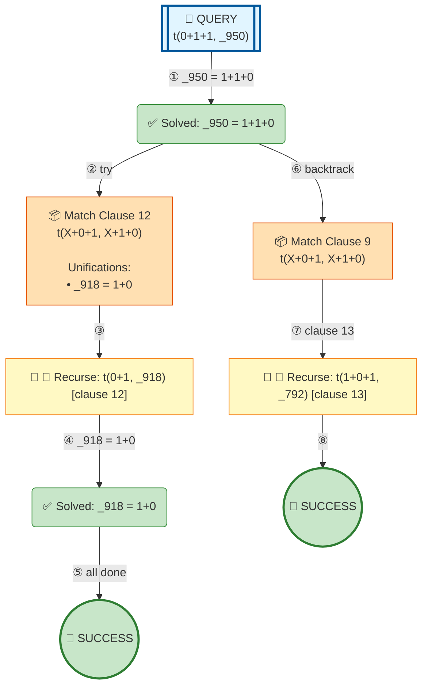

# Prolog Execution Tree: t(0+1+1, B)

## Query

```prolog
t(0+1+1, B)
```

## Clauses Defined

4. `test1 :- write('test1')`
5. `diana was the secretary`
6. `test2 :- write('test2')`
8. `t(0+1, 1+0)`
9. `t(X+0+1, X+1+0)`
10. `t(X+1+1, Z) :- t(X+1, X1), t(X1+1, Z)`
13. `show_clauses :- forall( clause(t(A,B), Body, Ref), ( clause_property(Ref, line_count(Line)), format('Clause ref ~w: t(~w,~w) at line ~w~n', [Ref, A, B, Line]) ) )`

## Search Tree Visualization



### Legend

- 🎯 **Blue**: Initial query
- 🔄 **Yellow**: Currently solving goal
- 📦 **Orange**: Clause match with unifications
- ⏸️ **Gray**: Pending goals (waiting for current goal to complete)
- ✅ **Green**: Solved goal with binding
- 🎉 **Green**: Final success
- **Solid arrows**: Active execution flow
- **Dashed arrows**: Goals queued for later
- **Double arrows (green)**: Pending goal becomes active

## Step-by-Step Execution

### Step 3

**Goal:** `t(0+1,_918)`

**Action:** Solving t(0+1,_918)

**Clause matched:** `_918 = 1+0`

### Step 5

**Goal:** `true`

**Action:** Solving true

### Step 7

**Goal:** `t(1+0+1,_792)`

**Action:** Backtracking: t(1+0+1,_792)

### Step 8

**Goal:** `true`

**Action:** Solving true


## Final Answer

Query succeeded with no bindings.