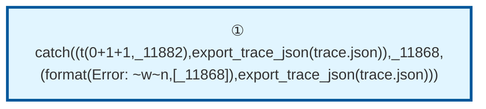

# Prolog Execution Trace: t(0+1+1, B)

## Query

```
t(0+1+1, B)
```

## Clause Definitions

| Line # | Clause |
|--------|--------|
| 4 | `test1 :- write('test1')` |
| 5 | `diana was the secretary` |
| 6 | `test2 :- write('test2')` |
| 8 | `t(0+1, 1+0)` |
| 9 | `t(X+0+1, X+1+0)` |
| 10 | `t(X+1+1, Z) :- t(X+1, X1), t(X1+1, Z)` |
| 13 | `show_clauses :- forall( clause(t(A,B), Body, Ref), ( clause_property(Ref, line_count(Line)), format('Clause ref ~w: t(~w,~w) at line ~w~n', [Ref, A, B, Line]) ) )` |

## Execution Timeline

┌─ Step 1: CALL catch((t(0+1+1,_11882),export_trace_json(trace.json)),_11868,(format(Error: ~w~n,[_11868]),export_trace_json(trace.json)))
└─

┌─ Step 2: CALL t(0+1+1,_924)
└─

┌─ Step 3: CALL t(0+1,_886)
└─

┌─ Step 4: EXIT t(0+1,1+0)
│  Bindings:
│    _886 = 1+0
│  Returns to: Step 3
└─

┌─ Step 5: CALL t(1+0+1,_760)
└─

┌─ Step 6: EXIT t(1+0+1,1+1+0)
│  Bindings:
│    _760 = 1+1+0
│  Returns to: Step 5
└─

┌─ Step 7: EXIT t(0+1+1,1+1+0)
│  Bindings:
│    _924 = 1+1+0
│  Returns to: Step 2
└─

┌─ Step 8: CALL export_trace_json(trace.json)
└─


## Call Tree



## Final Answer

Query succeeded with no bindings.

_Showing first solution only._