# Prolog Execution Tree: t(0+1+1, B)

## Query

```prolog
t(0+1+1, B)
```

## Clauses Defined

| Line # | Clause |
|--------|--------|
| 26 | `t(0+1, 1+0)` |
| 27 | `t(X+0+1, X+1+0)` |
| 28 | `t(X+1+1, Z) :- t(X+1, X1), t(X1+1, Z)` |

## Search Tree Visualization

```mermaid
graph TD

%% Nodes
A[["🎯 QUERY<br/>t(0+1+1, B)"]]
B["📦 Match Clause 28<br/>t(X+1+1, Z)<br/><br/>Unifications:<br/>• X = 0<br/>• Z = B"]
C["🔄 🔁 Recurse: t(0+1, _886) [clause 26]"]
D["📦 Match Clause 26<br/>t(0+1, 1+0)<br/><br/>Unifications:<br/>• 1+0 = _886"]
E(("🎉 SUCCESS"))
F["📦 Match Clause 27<br/>t(X+0+1, X+1+0)"]
G["🔄 🔁 Recurse: t(1+0+1, _760) [clause 27]"]
H(("🎉 SUCCESS"))

%% Edges
A -->|"① try"| B
B -->|"② try"| D
D -->|"③"| C
C -->|"④ success"| E
B -->|"⑤ backtrack"| F
F -->|"⑥ clause 27"| G
G -->|"⑦"| H

%% Styles
style A fill:#e1f5ff,stroke:#01579b,stroke-width:3px
style B fill:#ffe0b2,stroke:#e65100
style C fill:#fff9c4,stroke:#f57f17
style D fill:#ffe0b2,stroke:#e65100
style E fill:#c8e6c9,stroke:#2e7d32,stroke-width:3px
style F fill:#ffe0b2,stroke:#e65100
style G fill:#fff9c4,stroke:#f57f17
style H fill:#c8e6c9,stroke:#2e7d32,stroke-width:3px
```



### Legend

- 🎯 **Blue**: Initial query
- 🔄 **Yellow**: Currently solving goal
- 📦 **Orange**: Clause match with unifications
- ⏸️ **Gray**: Pending goals (waiting for current goal to complete)
- ✅ **Green**: Solved goal with binding
- 🎉 **Green**: Final success
- **Solid arrows**: Active execution flow
- **Dashed arrows**: Goals queued for later
- **Double arrows (green)**: Pending goal becomes active

## Step-by-Step Execution

### Step 3

**Goal:** `t(0+1,_886)`

**Action:** Solving t(0+1,_886)

**Clause matched:** `_886 = 1+0`

### Step 4

**Goal:** `true`

**Action:** Solving true

### Step 6

**Goal:** `t(1+0+1,_760)`

**Action:** Backtracking: t(1+0+1,_760)

### Step 7

**Goal:** `true`

**Action:** Solving true


## Final Answer

Query succeeded with no bindings.