# Prolog Execution Tree: t(0+1, A)

## Query

```prolog
t(0+1, A)
```

## Clauses Defined

1. `t(0+1, 1+0)`
2. `t(X+0+1, X+1+0)`
3. `t(X+1+1, Z) :- t(X+1, X1), t(X1+1, Z)`

## Search Tree Visualization

```mermaid
graph TD

%% Nodes
A[["🎯 QUERY<br/>t(0+1, A₀)"]]
B(("🎉 SUCCESS<br/>A = 1+0"))
C["📦 Match Clause 1<br/>t(0+1, 1+0)"]

%% Edges
A -->|"① try"| C
C -->|"②"| B

%% Styles
style A fill:#e1f5ff,stroke:#01579b,stroke-width:3px
style B fill:#c8e6c9,stroke:#2e7d32,stroke-width:3px
style C fill:#ffe0b2,stroke:#e65100
```



### Legend

- 🎯 **Blue**: Initial query
- 🔄 **Yellow**: Currently solving goal
- 📦 **Orange**: Clause match with unifications
- ⏸️ **Gray**: Pending goals (waiting for current goal to complete)
- ✅ **Green**: Solved goal with binding
- 🎉 **Green**: Final success
- **Solid arrows**: Active execution flow
- **Dashed arrows**: Goals queued for later
- **Double arrows (green)**: Pending goal becomes active

## Step-by-Step Execution

### Step 2

**Goal:** `true`

**Action:** Solving true


## Final Answer

```prolog
A = 1+0
```