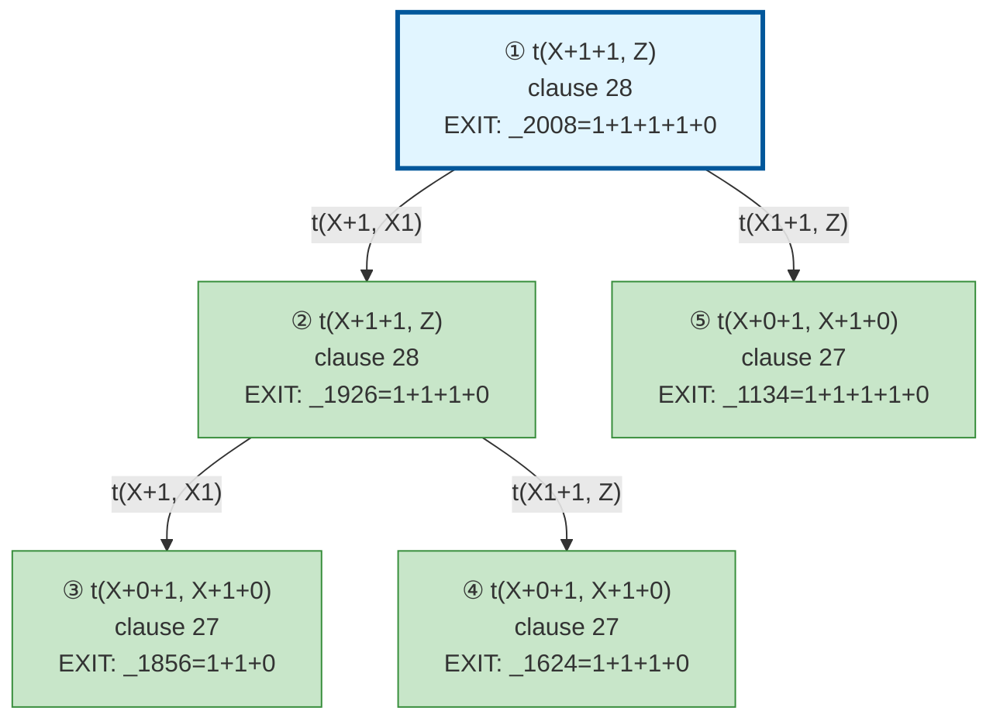

# Prolog Execution Trace: t(1+0+1+1+1, A)

## Query

```
t(1+0+1+1+1, A)
```

## Clause Definitions

| Line # | Clause |
|--------|--------|
| 5 | `test1 :- Term = (jimmy plays football and squash), write('Pretty: '), write(Term), nl, write('Canonical: '), write_canonical(Term), nl` |
| 10 | `test2 :- Term = (susan plays tennis and basketball and volleyball), write('Pretty: '), write(Term), nl, write('Canonical: '), write_canonical(Term), nl` |
| 19 | `diana was the secretary of the department` |
| 20 | `test3 :- Term = (diana was the secretary of the department), write('Pretty: '), write(Term), nl, write('Canonical: '), write_canonical(Term), nl` |
| 26 | `t(0+1, 1+0)` |
| 27 | `t(X+0+1, X+1+0)` |
| 28 | `t(X+1+1, Z) :- t(X+1, X1), t(X1+1, Z)` |

## Execution Timeline

┌─ Step 1: t(1+0+1+1+1,_2008)
│  
│  Clause: t(X+1+1, Z) [line 28]
│  Unifications:
│    X = 1+0+1
│    Z = _2008
│  Subgoals:
│    [1.1] t(X+1, X1) → t(1+0+1+1, X1)
│    [1.2] t(X1+1, Z) → t(X1+1, _2008)
│  Result: 1+1+1+1+0
│  Query Variable: A = 1+1+1+1+0
└─

┌─ Step 2: t(1+0+1+1,_1926)
│  ◀── Solving subgoal [1.1]
│  
│  Clause: t(X+1+1, Z) [line 28]
│  Unifications:
│    X = 1+0
│    Z = _1926
│  Subgoals:
│    [2.1] t(X+1, X1) → t(1+0+1, X1)
│    [2.2] t(X1+1, Z) → t(X1+1, _1926)
│  Result: 1+1+1+0
│  Query Variable: A = ?
└─

┌─ Step 3: t(1+0+1,_1856)
│  ◀── Solving subgoal [2.1]
│  
│  Fact: t(X+0+1, X+1+0) [line 27]
│  Unifications:
│    X = 1
│  Result: 1+1+0
│  Query Variable: A = ?
└─

┌─ Step 4: t(1+1+0+1,_1624)
│  ◀── Solving subgoal [2.2]
│  
│  Fact: t(X+0+1, X+1+0) [line 27]
│  Unifications:
│    X = 1+1
│  Result: 1+1+1+0
│  Query Variable: A = ?
└─

┌─ Step 5: t(1+1+1+0+1,_1134)
│  ◀── Solving subgoal [1.2]
│  
│  Fact: t(X+0+1, X+1+0) [line 27]
│  Unifications:
│    X = 1+1+1
│  Result: 1+1+1+1+0
│  Query Variable: A = 1+1+1+1+0
└─


## Call Tree



## Final Answer

```
A = 1+1+1+1+0
```

_Showing first solution only._