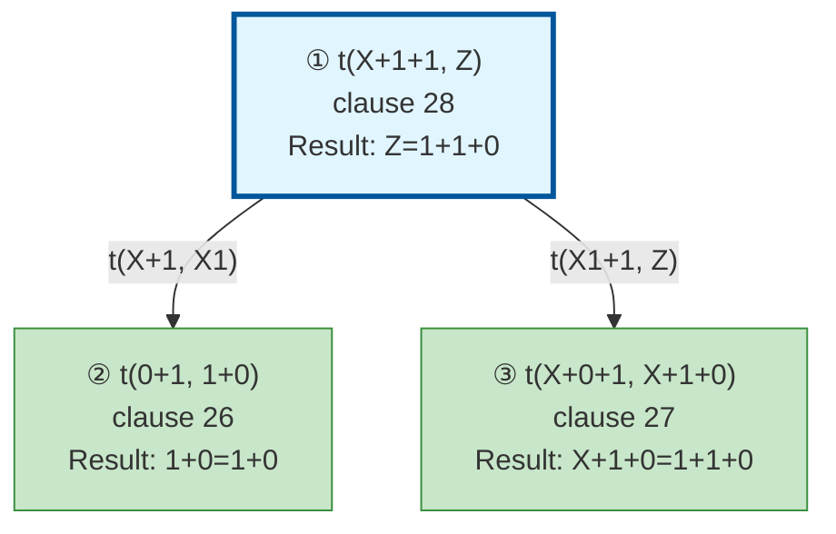

# Prolog Execution Trace: t(0+1+1, B)

## Query

```
t(0+1+1, B)
```

## Clause Definitions

| Line # | Clause |
|--------|--------|
| 5 | `test1 :- Term = (jimmy plays football and squash), write('Pretty: '), write(Term), nl, write('Canonical: '), write_canonical(Term), nl` |
| 10 | `test2 :- Term = (susan plays tennis and basketball and volleyball), write('Pretty: '), write(Term), nl, write('Canonical: '), write_canonical(Term), nl` |
| 19 | `diana was the secretary of the department` |
| 20 | `test3 :- Term = (diana was the secretary of the department), write('Pretty: '), write(Term), nl, write('Canonical: '), write_canonical(Term), nl` |
| 26 | `t(0+1, 1+0)` |
| 27 | `t(X+0+1, X+1+0)` |
| 28 | `t(X+1+1, Z) :- t(X+1, X1), t(X1+1, Z)` |

## Execution Timeline

┌─ Step 1: t(0+1+1,Z)
│  Clause: t(X+1+1, Z) [line 28]
│  Unifications:
│    X = 0
│  Subgoals:
│    [1.1] t(X+1, X1) → t(0+1, X1)
│    [1.2] t(X1+1, Z)
│  
│  ┌─ Step 2 [Goal 1.1]: t(0+1,1+0)
│  │  Fact: t(0+1, 1+0) [line 26]
│  │  => 1+0 = 1+0
│  └─
│  ┌─ Step 3 [Goal 1.2]: t(X1+1, Z) → t(1+0+1,X+1+0)
│  │  where X1 = 1+0 (from Step 2)
│  │  Fact: t(X+0+1, X+1+0) [line 27]
│  │  Unifications:
│  │    X = 1
│  │  => X+1+0 = 1+1+0
│  └─
│  => Z = 1+1+0
│  Query Variable: B = 1+1+0
└─


## Call Tree



## Final Answer

```
B = 1+1+0
```

_Showing first solution only._