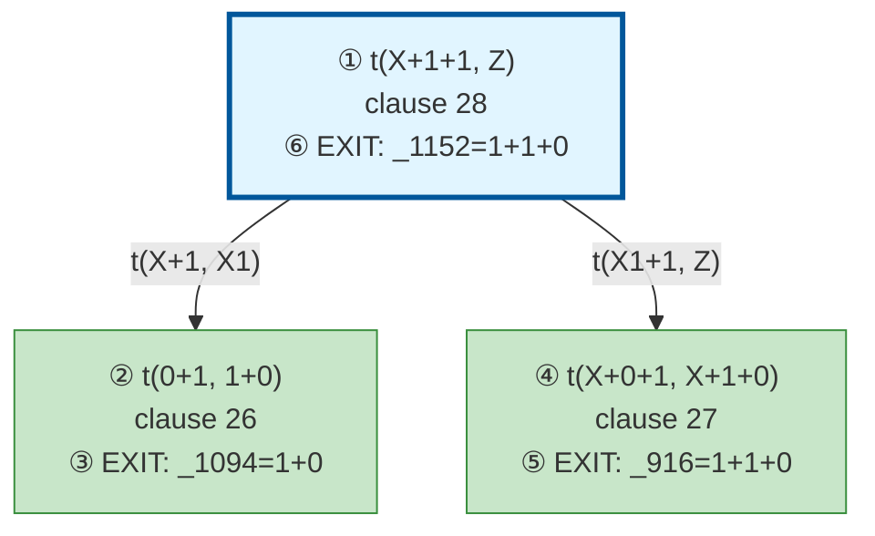

# Prolog Execution Trace: t(0+1+1, B)

## Query

```
t(0+1+1, B)
```

## Clause Definitions

| Line # | Clause |
|--------|--------|
| 5 | `test1 :- Term = (jimmy plays football and squash), write('Pretty: '), write(Term), nl, write('Canonical: '), write_canonical(Term), nl` |
| 10 | `test2 :- Term = (susan plays tennis and basketball and volleyball), write('Pretty: '), write(Term), nl, write('Canonical: '), write_canonical(Term), nl` |
| 19 | `diana was the secretary of the department` |
| 20 | `test3 :- Term = (diana was the secretary of the department), write('Pretty: '), write(Term), nl, write('Canonical: '), write_canonical(Term), nl` |
| 26 | `t(0+1, 1+0)` |
| 27 | `t(X+0+1, X+1+0)` |
| 28 | `t(X+1+1, Z) :- t(X+1, X1), t(X1+1, Z)` |

## Execution Timeline

┌─ Step 1: CALL t(0+1+1,_1152)
│  
│  Pattern Match:
│    Goal: t(0+1+1,_1152)
│    Head: t(X+1+1, Z)
│    ├─ X = 0
│    ├─ Z = _1152
│  
│  Clause: t(X+1+1, Z) :- t(X+1, X1), t(X1+1, Z) [line 28]
│  Spawns subgoals:
│    [1.1] t(X+1, X1)
│    [1.2] t(X1+1, Z)
└─

┌─ Step 2: CALL t(0+1,_1094)
│  ◀── Solving subgoal [1.1]
│  
│  Pattern Match:
│    Goal: t(0+1,_1094)
│    Head: t(0+1, 1+0)
│  
│  Clause: t(0+1, 1+0) [line 26] (fact)
└─

┌─ Step 3: EXIT t(0+1,1+0)
│  ◀── Completed subgoal [1.1]
│  Bindings:
│    _1094 = 1+0
│  Returns to: Step 2
│  Next: Subgoal [1.2]
└─

┌─ Step 4: CALL t(1+0+1,_916)
│  ◀── Solving subgoal [1.2]
│  
│  Pattern Match:
│    Goal: t(1+0+1,_916)
│    Head: t(X+0+1, X+1+0)
│    ├─ X = 1
│  
│  Clause: t(X+0+1, X+1+0) [line 27] (fact)
└─

┌─ Step 5: EXIT t(1+0+1,1+1+0)
│  ◀── Completed subgoal [1.2]
│  Bindings:
│    _916 = 1+1+0
│  Returns to: Step 4
└─

┌─ Step 6: EXIT t(0+1+1,1+1+0)
│  Bindings:
│    _1152 = 1+1+0
│  Returns to: Step 1
│  Note: Z from Step 1 is now bound to 1+1+0
└─


## Call Tree



## Final Answer

```
B = 1+1+0
```

_Showing first solution only._