# Prolog Execution Tree: t(0+1+1, B)

## Query

```prolog
t(0+1+1, B)
```

## Clauses Defined

5. `test1 :- Term = (jimmy plays football and squash), write('Pretty: '), write(Term), nl, write('Canonical: '), write_canonical(Term), nl`
10. `test2 :- Term = (susan plays tennis and basketball and volleyball), write('Pretty: '), write(Term), nl, write('Canonical: '), write_canonical(Term), nl`
19. `diana was the secretary of the department`
20. `test3 :- Term = (diana was the secretary of the department), write('Pretty: '), write(Term), nl, write('Canonical: '), write_canonical(Term), nl`
26. `t(0+1, 1+0)`
27. `t(X+0+1, X+1+0)`
28. `t(X+1+1, Z) :- t(X+1, X1), t(X1+1, Z)`

## Search Tree Visualization

```mermaid
graph TD

%% Nodes
A[["🎯 QUERY<br/>t(0+1+1, _950)"]]
B["📦 Match Clause 32<br/>t(0+1, 1+0)<br/><br/>Unifications:<br/>• B = 1+1+0<br/><br/>Clause Type: Fact (no body)"]
C("✅ Solved: _950 = 1+1+0")
D["🔄 🔁 Recurse: t(0+1, _918) [clause 30]"]
E["📦 Match Clause 30<br/>t(0+1, 1+0)<br/><br/>Unifications:<br/>• B = 1+0"]
F("✅ Solved: _918 = 1+0")
G(("🎉 SUCCESS"))
H["📦 Match Clause 27<br/>t(X+0+1, X+1+0)"]
I["🔄 🔁 Recurse: t(1+0+1, _792) [clause 31]"]
J(("🎉 SUCCESS"))

%% Edges
A -->|"① try"| B
A -->|"② _950 = 1+1+0"| C
C -->|"③ try"| E
E -->|"④"| D
D -->|"⑤ _918 = 1+0"| F
F -->|"⑥ all done"| G
C -->|"⑦ backtrack"| H
H -->|"⑧ clause 31"| I
I -->|"⑨"| J

%% Styles
style A fill:#e1f5ff,stroke:#01579b,stroke-width:3px
style B fill:#ffe0b2,stroke:#e65100
style C fill:#c8e6c9,stroke:#388e3c
style D fill:#fff9c4,stroke:#f57f17
style E fill:#ffe0b2,stroke:#e65100
style F fill:#c8e6c9,stroke:#388e3c
style G fill:#c8e6c9,stroke:#2e7d32,stroke-width:3px
style H fill:#ffe0b2,stroke:#e65100
style I fill:#fff9c4,stroke:#f57f17
style J fill:#c8e6c9,stroke:#2e7d32,stroke-width:3px
```



### Legend

- 🎯 **Blue**: Initial query
- 🔄 **Yellow**: Currently solving goal
- 📦 **Orange**: Clause match with unifications
- ⏸️ **Gray**: Pending goals (waiting for current goal to complete)
- ✅ **Green**: Solved goal with binding
- 🎉 **Green**: Final success
- **Solid arrows**: Active execution flow
- **Dashed arrows**: Goals queued for later
- **Double arrows (green)**: Pending goal becomes active

## Step-by-Step Execution

### Step 4

**Goal:** `t(0+1,_918)`

**Action:** Solving t(0+1,_918)

**Clause matched:** `_918 = 1+0`

### Step 6

**Goal:** `true`

**Action:** Solving true

### Step 8

**Goal:** `t(1+0+1,_792)`

**Action:** Backtracking: t(1+0+1,_792)

### Step 9

**Goal:** `true`

**Action:** Solving true


## Final Answer

Query succeeded with no bindings.