# Prolog Execution Tree: t(0 + 1 + 1, B)

## Query

```prolog
t(0 + 1 + 1, B)
```

## Clauses Defined

30. `t(0+1,1+0)`
31. `t(_752+0+1,_752+1+0)`
32. `t(_610+1+1,_600) :- t(_610+1,_624),t(_624+1,_600)`

## Search Tree Visualization

```mermaid
graph TD

%% Nodes
A[["🎯 QUERY<br/>t(0+1+1, _950)"]]
B("✅ Solved: _950 = 1+1+0")
C["🔄 🔁 Recurse: t(0+1, _918) [clause 30]"]
D["📦 Match Clause 30<br/>t(_752+0+1,_752+1+0)<br/><br/>Unifications:<br/>• _918 = 1+0"]
E("✅ Solved: _918 = 1+0")
F(("🎉 SUCCESS"))
G["📦 Match Clause 31<br/>t(_752+0+1,_752+1+0)"]
H["🔄 🔁 Recurse: t(1+0+1, _792) [clause 31]"]
I(("🎉 SUCCESS"))

%% Edges
A -->|"① _950 = 1+1+0"| B
B -->|"② try"| D
D -->|"③"| C
C -->|"④ _918 = 1+0"| E
E -->|"⑤ all done"| F
B -->|"⑥ backtrack"| G
G -->|"⑦ clause 31"| H
H -->|"⑧"| I

%% Styles
style A fill:#e1f5ff,stroke:#01579b,stroke-width:3px
style B fill:#c8e6c9,stroke:#388e3c
style C fill:#fff9c4,stroke:#f57f17
style D fill:#ffe0b2,stroke:#e65100
style E fill:#c8e6c9,stroke:#388e3c
style F fill:#c8e6c9,stroke:#2e7d32,stroke-width:3px
style G fill:#ffe0b2,stroke:#e65100
style H fill:#fff9c4,stroke:#f57f17
style I fill:#c8e6c9,stroke:#2e7d32,stroke-width:3px
```



### Legend

- 🎯 **Blue**: Initial query
- 🔄 **Yellow**: Currently solving goal
- 📦 **Orange**: Clause match with unifications
- ⏸️ **Gray**: Pending goals (waiting for current goal to complete)
- ✅ **Green**: Solved goal with binding
- 🎉 **Green**: Final success
- **Solid arrows**: Active execution flow
- **Dashed arrows**: Goals queued for later
- **Double arrows (green)**: Pending goal becomes active

## Step-by-Step Execution

### Step 3

**Goal:** `t(0+1,_918)`

**Action:** Solving t(0+1,_918)

**Clause matched:** `_918 = 1+0`

### Step 5

**Goal:** `true`

**Action:** Solving true

### Step 7

**Goal:** `t(1+0+1,_792)`

**Action:** Backtracking: t(1+0+1,_792)

### Step 8

**Goal:** `true`

**Action:** Solving true


## Final Answer

Query succeeded with no bindings.