# Prolog Execution Tree: append([1,2], [3,4], X)

## Query

```prolog
append([1,2], [3,4], X)
```

## Clauses Defined

1. `append([], L, L)`
2. `append([H|T], L, [H|R]) :- append(T, L, R)`

## Search Tree Visualization

```mermaid
graph TD

%% Nodes
A[["🎯 QUERY<br/>append([1, 2], [3, 4], X₀)"]]
B["🔄 🔁 Recurse: append([2], [3, 4], R₀) [clause 2]"]
C["📦 Match Clause 2<br/>append([H|T], L, [H|R]) :- append(T, L, R)<br/><br/>Unifications:<br/>• [2] = [H|T]<br/>• L = [3,4]<br/>• R₀ = [H|R]<br/><br/>Subgoals:<br/>• append(T, L, R)"]
D[/"📋 Clause 2 body:<br/>append([], [3, 4], R₁)"/]
E("✅ Solved: R₀ = [2|R₁]")
F["🔄 🔁 Recurse: append([], [3, 4], R₁) [clause 2]"]
G["📦 Match Clause 2<br/>append([H|T], L, [H|R]) :- append(T, L, R)<br/><br/>Unifications:<br/>• [] = [H|T]<br/>• L = [3,4]<br/>• R₁ = [H|R]<br/><br/>Subgoals:<br/>• append(T, L, R)"]
H[/"📋 Clause 2 body:<br/>append([], [3, 4], R₁)"/]
I("✅ Solved: R₁ = [3,4]")
J(("🎉 SUCCESS<br/>Result = true"))
K["📦 Match Clause 1<br/>append([], L, L)"]

%% Edges
A -->|"① try"| C
C -->|"② matched"| B
B -->|"③ clause body"| D
B -->|"④ R₀ = [2|R₁]"| E
E -->|"⑤ try"| G
G -->|"⑥ matched"| F
F -->|"⑦ clause body"| H
F -->|"⑧ R₁ = [3,4]"| I
I -->|"⑨ try"| K
K -->|"⑩ matched"| J

%% Styles
style A fill:#e1f5ff,stroke:#01579b,stroke-width:3px
style B fill:#fff9c4,stroke:#f57f17
style C fill:#ffe0b2,stroke:#e65100
style D fill:#e1bee7,stroke:#7b1fa2
style E fill:#c8e6c9,stroke:#388e3c
style F fill:#fff9c4,stroke:#f57f17
style G fill:#ffe0b2,stroke:#e65100
style H fill:#e1bee7,stroke:#7b1fa2
style I fill:#c8e6c9,stroke:#388e3c
style J fill:#c8e6c9,stroke:#2e7d32,stroke-width:3px
style K fill:#ffe0b2,stroke:#e65100
```



### Legend

- 🎯 **Blue**: Initial query
- 🔄 **Yellow**: Currently solving goal
- 📦 **Orange**: Clause match with unifications
- ⏸️ **Gray**: Pending goals (waiting for current goal to complete)
- ✅ **Green**: Solved goal with binding
- 🎉 **Green**: Final success
- **Solid arrows**: Active execution flow
- **Dashed arrows**: Goals queued for later
- **Double arrows (green)**: Pending goal becomes active

## Step-by-Step Execution

### Step 2

**Goal:** `append([2],[3,4],R₀)`

**Action:** Solving append([2],[3,4],R₀)

**Clause matched:** `R₀/[2|R₁]`

### Step 6

**Goal:** `append([],[3,4],R₁)`

**Action:** Solving append([],[3,4],R₁)

**Clause matched:** `R₁/[3,4]`

### Step 10

**Goal:** `true`

**Action:** Solving true


## Final Answer

```prolog
X = [1|R₀]
```