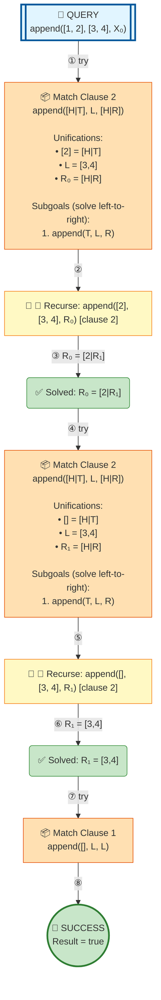

# Prolog Execution Tree: append([1,2], [3,4], X)

## Query

```prolog
append([1,2], [3,4], X)
```

## Clauses Defined

1. `append([], L, L)`
2. `append([H|T], L, [H|R]) :- append(T, L, R)`

## Search Tree Visualization



### Legend

- 🎯 **Blue**: Initial query
- 🔄 **Yellow**: Currently solving goal
- 📦 **Orange**: Clause match with unifications
- ⏸️ **Gray**: Pending goals (waiting for current goal to complete)
- ✅ **Green**: Solved goal with binding
- 🎉 **Green**: Final success
- **Solid arrows**: Active execution flow
- **Dashed arrows**: Goals queued for later
- **Double arrows (green)**: Pending goal becomes active

## Step-by-Step Execution

### Step 2

**Goal:** `append([2],[3,4],R₀)`

**Action:** Solving append([2],[3,4],R₀)

**Clause matched:** `R₀/[2|R₁]`

### Step 5

**Goal:** `append([],[3,4],R₁)`

**Action:** Solving append([],[3,4],R₁)

**Clause matched:** `R₁/[3,4]`

### Step 8

**Goal:** `true`

**Action:** Solving true


## Final Answer

```prolog
X = [1|R₀]
```