# Prolog Execution Tree: append([1,2], [3,4], X)

## Query

```prolog
append([1,2], [3,4], X)
```

## Clauses Defined

4. `append([], L, L)`
5. `append([H|T], L, [H|R]) :- append(T, L, R)`

## Search Tree Visualization

```mermaid
graph TD

%% Nodes
A[["🎯 QUERY<br/>append([1, 2], [3, 4], _1056)"]]
B("✅ Solved: _1056 = [1,2,3,4]")
C["🔄 🔁 Recurse: append([2], [3, 4], _1010) [clause 9]"]
D["📦 Match Clause 9<br/>append([H|T], L, [H|R])<br/><br/>Unifications:<br/>• _1010 = [2,3,4]<br/><br/>Subgoals (solve left-to-right):<br/>1. append(T, L, R)"]
E("✅ Solved: _1010 = [2,3,4]")
F["🔄 🔁 Recurse: append([], [3, 4], _970) [clause 8]"]
G["📦 Match Clause 8<br/>append([], L, L)<br/><br/>Unifications:<br/>• _970 = [3,4]"]
H("✅ Solved: _970 = [3,4]")
I(("🎉 SUCCESS"))

%% Edges
A -->|"① _1056 = [1,2,3,4]"| B
B -->|"② try"| D
D -->|"③"| C
C -->|"④ _1010 = [2,3,4]"| E
E -->|"⑤ try"| G
G -->|"⑥"| F
F -->|"⑦ _970 = [3,4]"| H
H -->|"⑧ all done"| I

%% Styles
style A fill:#e1f5ff,stroke:#01579b,stroke-width:3px
style B fill:#c8e6c9,stroke:#388e3c
style C fill:#fff9c4,stroke:#f57f17
style D fill:#ffe0b2,stroke:#e65100
style E fill:#c8e6c9,stroke:#388e3c
style F fill:#fff9c4,stroke:#f57f17
style G fill:#ffe0b2,stroke:#e65100
style H fill:#c8e6c9,stroke:#388e3c
style I fill:#c8e6c9,stroke:#2e7d32,stroke-width:3px
```



### Legend

- 🎯 **Blue**: Initial query
- 🔄 **Yellow**: Currently solving goal
- 📦 **Orange**: Clause match with unifications
- ⏸️ **Gray**: Pending goals (waiting for current goal to complete)
- ✅ **Green**: Solved goal with binding
- 🎉 **Green**: Final success
- **Solid arrows**: Active execution flow
- **Dashed arrows**: Goals queued for later
- **Double arrows (green)**: Pending goal becomes active

## Step-by-Step Execution

### Step 3

**Goal:** `append([2],[3,4],_1010)`

**Action:** Solving append([2],[3,4],_1010)

**Clause matched:** `_1010 = [2,3,4]`

### Step 6

**Goal:** `append([],[3,4],_970)`

**Action:** Solving append([],[3,4],_970)

**Clause matched:** `_970 = [3,4]`

### Step 8

**Goal:** `true`

**Action:** Solving true


## Final Answer

Query succeeded with no bindings.