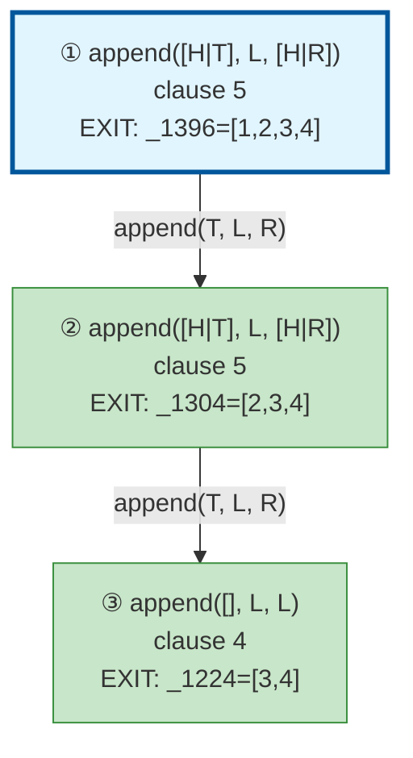

# Prolog Execution Trace: append([1,2], [3,4], X)

## Query

```
append([1,2], [3,4], X)
```

## Clause Definitions

| Line # | Clause |
|--------|--------|
| 4 | `append([], L, L)` |
| 5 | `append([H|T], L, [H|R]) :- append(T, L, R)` |

## Execution Timeline

┌─ Step 1: append([1,2],[3,4],_1396)
│  Clause: append([H|T], L, [H|R]) [line 5]
│  Unifications:
│    H = 1
│    T = [2]
│    L = [3,4]
│  Subgoals:
│    [1.1] append(T, L, R) → append([2], [3,4], R)
│  
│  ┌─ Step 2 [Goal 1.1]: append([2],[3,4],_1304)
│  │  Clause: append([H|T], L, [H|R]) [line 5]
│  │  Unifications:
│  │    H = 2
│  │    T = []
│  │    L = [3,4]
│  │  Subgoals:
│  │    [2.1] append(T, L, R) → append([], [3,4], R)
│  │  
│  │  ┌─ Step 3 [Goal 2.1]: append([],[3,4],_1224)
│  │  │  Fact: append([], L, L) [line 4]
│  │  │  Unifications:
│  │  │    L = [3,4]
│  │  │    L = _1224
│  │  │  => _1224 = [3,4]
│  │  └─
│  │  => _1304 = [2,3,4]
│  └─
│  => _1396 = [1,2,3,4]
│  Query Variable: X = [1,2,3,4]
└─


## Call Tree



## Final Answer

```
X = [1,2,3,4]
```

_Showing first solution only._