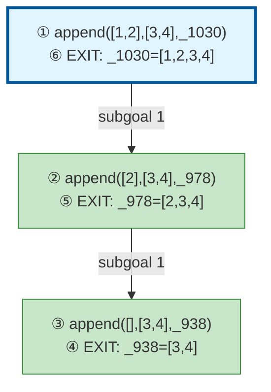

# Prolog Execution Trace: append([1,2], [3,4], L)

## Query

```
append([1,2], [3,4], L)
```

## Clause Definitions

| Line # | Clause |
|--------|--------|
| 4 | `append([], L, L)` |
| 5 | `append([H|T], L, [H|R]) :- append(T, L, R)` |

## Execution Timeline

┌─ Step 1: CALL append([1,2],[3,4],_1030)
└─

┌─ Step 2: CALL append([2],[3,4],_978)
└─

┌─ Step 3: CALL append([],[3,4],_938)
└─

┌─ Step 4: EXIT append([],[3,4],[3,4])
│  Bindings:
│    _938 = [3,4]
│  Returns to: Step 3
└─

┌─ Step 5: EXIT append([2],[3,4],[2,3,4])
│  Bindings:
│    _978 = [2,3,4]
│  Returns to: Step 2
└─

┌─ Step 6: EXIT append([1,2],[3,4],[1,2,3,4])
│  Bindings:
│    _1030 = [1,2,3,4]
│  Returns to: Step 1
└─


## Call Tree



## Final Answer

```
L = [1,2,3,4]
```

_Showing first solution only._