# Prolog Execution Tree: append([1,2], [3,4], X)

## Query

```prolog
append([1,2], [3,4], X)
```

## Search Tree Visualization

```mermaid
graph TD

%% Nodes
A[["🎯 QUERY<br/>append([1, 2], [3, 4], X₀)"]]
B["🔄 Solve: append([2], [3, 4], R₀) [clause 2]"]
C("✅ Solved: R₀ = [2|R₁]")
D["🔄 Solve: append([], [3, 4], R₁) [clause 2]"]
E("✅ Solved: R₁ = [3,4]")
F(("🎉 SUCCESS"))

%% Edges
A -->|"① clause 2"| B
B -->|"② R₀ = [2|R₁]"| C
C -->|"③ clause 2"| D
D -->|"④ R₁ = [3,4]"| E
E -->|"⑤ all done"| F

%% Styles
style A fill:#e1f5ff,stroke:#01579b,stroke-width:3px
style B fill:#fff9c4,stroke:#f57f17
style C fill:#c8e6c9,stroke:#388e3c
style D fill:#fff9c4,stroke:#f57f17
style E fill:#c8e6c9,stroke:#388e3c
style F fill:#c8e6c9,stroke:#2e7d32,stroke-width:3px
```



### Legend

- 🎯 **Blue**: Initial query
- 🔄 **Yellow**: Currently solving goal
- ⏸️ **Gray**: Pending goals (waiting for current goal to complete)
- ✅ **Green**: Solved goal with binding
- 🎉 **Green**: Final success
- **Solid arrows**: Active execution flow
- **Dashed arrows**: Goals queued for later
- **Double arrows (green)**: Pending goal becomes active

## Step-by-Step Execution

### Step 1

**Goal:** `append([2],[3,4],R₀)`

**Action:** Solving append([2],[3,4],R₀)

**Clause matched:** `R₀/[2|R₁]`

### Step 3

**Goal:** `append([],[3,4],R₁)`

**Action:** Solving append([],[3,4],R₁)

**Clause matched:** `R₁/[3,4]`

### Step 5

**Goal:** `true`

**Action:** Solving true


## Final Answer

```prolog
X = [1|R₀]
```

## Clauses Defined

1. `append([], L, L)`
2. `append([H|T], L, [H|R]) :- append(T, L, R)`