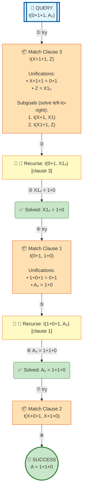

# Prolog Execution Tree: t(0+1+1, A)

## Query

```prolog
t(0+1+1, A)
```

## Clauses Defined

1. `t(0+1, 1+0)`
2. `t(X+0+1, X+1+0)`
3. `t(X+1+1, Z) :- t(X+1, X1), t(X1+1, Z)`

## Search Tree Visualization



### Legend

- 🎯 **Blue**: Initial query
- 🔄 **Yellow**: Currently solving goal
- 📦 **Orange**: Clause match with unifications
- ⏸️ **Gray**: Pending goals (waiting for current goal to complete)
- ✅ **Green**: Solved goal with binding
- 🎉 **Green**: Final success
- **Solid arrows**: Active execution flow
- **Dashed arrows**: Goals queued for later
- **Double arrows (green)**: Pending goal becomes active

## Step-by-Step Execution

### Step 2

**Goal:** `t(0+1,X1₀)`

**Action:** Solving t(0+1,X1₀)

**Clause matched:** `X1₀/1+0`

### Step 5

**Goal:** `t(1+0+1,A₀)`

**Action:** Solving t(1+0+1,A₀)

**Clause matched:** `A₀/1+1+0`

### Step 8

**Goal:** `true`

**Action:** Solving true


## Final Answer

```prolog
A = 1+1+0
```