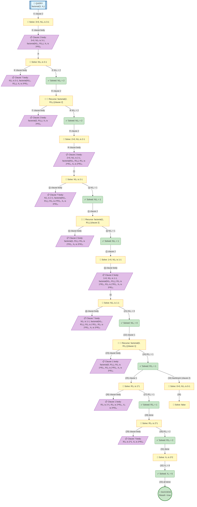

# Prolog Execution Tree: factorial(3, X)

## Query

```prolog
factorial(3, X)
```

## Clauses Defined

1. `factorial(0, 1)`
2. `factorial(N, R) :- N > 0, N1 is N - 1, factorial(N1, R1), R is N * R1`

## Search Tree Visualization



### Legend

- 🎯 **Blue**: Initial query
- 🔄 **Yellow**: Currently solving goal
- ⏸️ **Gray**: Pending goals (waiting for current goal to complete)
- ✅ **Green**: Solved goal with binding
- 🎉 **Green**: Final success
- **Solid arrows**: Active execution flow
- **Dashed arrows**: Goals queued for later
- **Double arrows (green)**: Pending goal becomes active

## Step-by-Step Execution

### Step 1

**Goal:** `3>0,N1₀ is 3-1`

**Action:** Solving 3>0,N1₀ is 3-1

### Step 3

**Goal:** `N1₀ is 3-1`

**Action:** Solving N1₀ is 3-1

**Clause matched:** `N1₀/2`

### Step 6

**Goal:** `factorial(2,R1₀)`

**Action:** Solving factorial(2,R1₀)

**Clause matched:** `N1₀/2`

### Step 9

**Goal:** `2>0,N1₁ is 2-1`

**Action:** Solving 2>0,N1₁ is 2-1

### Step 11

**Goal:** `N1₁ is 2-1`

**Action:** Solving N1₁ is 2-1

**Clause matched:** `N1₁/1`

### Step 14

**Goal:** `factorial(1,R1₁)`

**Action:** Solving factorial(1,R1₁)

**Clause matched:** `N1₁/1`

### Step 17

**Goal:** `1>0,N1₂ is 1-1`

**Action:** Solving 1>0,N1₂ is 1-1

### Step 19

**Goal:** `N1₂ is 1-1`

**Action:** Solving N1₂ is 1-1

**Clause matched:** `N1₂/0`

### Step 22

**Goal:** `factorial(0,R1₂)`

**Action:** Solving factorial(0,R1₂)

**Clause matched:** `R1₂/1`

### Step 25

**Goal:** `R1₁ is 1*1`

**Action:** Solving R1₁ is 1*1

**Clause matched:** `R1₁/1`

### Step 28

**Goal:** `R1₀ is 2*1`

**Action:** Solving R1₀ is 2*1

**Clause matched:** `R1₀/2`

### Step 31

**Goal:** `X₀ is 3*2`

**Action:** Solving X₀ is 3*2

**Clause matched:** `X₀/6`

### Step 33

**Goal:** `true`

**Action:** Solving true

### Step 34

**Goal:** `0>0,N1₃ is 0-1`

**Action:** Backtracking: 0>0,N1₃ is 0-1

### Step 35

**Goal:** `false`

**Action:** Solving false


## Final Answer

```prolog
X = 6
```