# Prolog Execution Tree: factorial(5, X)

## Query

```prolog
factorial(5, X)
```

## Clauses Defined

1. `factorial(0, 1)`
2. `factorial(N, R) :- N > 0, N1 is N - 1, factorial(N1, R1), R is N * R1`

## Search Tree Visualization

```mermaid
graph TD

%% Nodes
A[["🎯 QUERY<br/>factorial(5, X₀)"]]
B["🔄 Solve: 5>0"]
C["🔄 Solve: N1₀ is 5-1"]
D["🔄 Solve: N1₀ is 5-1"]
E("✅ Solved: N1₀ = 4")
F["🔄 🔁 Recurse: factorial(4, R1₀) [clause 2]"]
G["📦 Match Clause 2<br/>factorial(N, R)<br/><br/>Unifications:<br/>• N = 4<br/>• R = R1₀<br/><br/>Subgoals (solve left-to-right):<br/>1. N > 0<br/>2. N1 is N - 1<br/>3. factorial(N1, R1)<br/>4. R is N * R1"]
H("✅ Solved: N1₀ = 4")
I["🔄 Solve: 4>0"]
J["🔄 Solve: N1₁ is 4-1"]
K["🔄 Solve: N1₁ is 4-1"]
L("✅ Solved: N1₁ = 3")
M["🔄 🔁 Recurse: factorial(3, R1₁) [clause 2]"]
N["📦 Match Clause 2<br/>factorial(N, R)<br/><br/>Unifications:<br/>• N = 3<br/>• R = R1₁<br/><br/>Subgoals (solve left-to-right):<br/>1. N > 0<br/>2. N1 is N - 1<br/>3. factorial(N1, R1)<br/>4. R is N * R1"]
O("✅ Solved: N1₁ = 3")
P["🔄 Solve: 3>0"]
Q["🔄 Solve: N1₂ is 3-1"]
R["🔄 Solve: N1₂ is 3-1"]
S("✅ Solved: N1₂ = 2")
T["🔄 🔁 Recurse: factorial(2, R1₂) [clause 2]"]
U["📦 Match Clause 2<br/>factorial(N, R)<br/><br/>Unifications:<br/>• N = 2<br/>• R = R1₂<br/><br/>Subgoals (solve left-to-right):<br/>1. N > 0<br/>2. N1 is N - 1<br/>3. factorial(N1, R1)<br/>4. R is N * R1"]
V("✅ Solved: N1₂ = 2")
W["🔄 Solve: 2>0"]
X["🔄 Solve: N1₃ is 2-1"]
Y["🔄 Solve: N1₃ is 2-1"]
Z("✅ Solved: N1₃ = 1")
AA["🔄 🔁 Recurse: factorial(1, R1₃) [clause 2]"]
AB["📦 Match Clause 2<br/>factorial(N, R)<br/><br/>Unifications:<br/>• N = 1<br/>• R = R1₃<br/><br/>Subgoals (solve left-to-right):<br/>1. N > 0<br/>2. N1 is N - 1<br/>3. factorial(N1, R1)<br/>4. R is N * R1"]
AC("✅ Solved: N1₃ = 1")
AD["🔄 Solve: 1>0"]
AE["🔄 Solve: N1₄ is 1-1"]
AF["🔄 Solve: N1₄ is 1-1"]
AG("✅ Solved: N1₄ = 0")

%% Edges
A -->|"①"| B
B -->|"② next"| C
C -->|"③"| D
D -->|"④ N1₀ = 4"| E
E -->|"⑤ try"| G
G -->|"⑥"| F
F -->|"⑦ N1₀ = 4"| H
H -->|"⑧"| I
I -->|"⑨ next"| J
J -->|"⑩"| K
K -->|"⑪ N1₁ = 3"| L
L -->|"⑫ try"| N
N -->|"⑬"| M
M -->|"⑭ N1₁ = 3"| O
O -->|"⑮"| P
P -->|"⑯ next"| Q
Q -->|"⑰"| R
R -->|"⑱ N1₂ = 2"| S
S -->|"⑲ try"| U
U -->|"⑳"| T
T -->|"(21) N1₂ = 2"| V
V -->|"(22)"| W
W -->|"(23) next"| X
X -->|"(24)"| Y
Y -->|"(25) N1₃ = 1"| Z
Z -->|"(26) try"| AB
AB -->|"(27)"| AA
AA -->|"(28) N1₃ = 1"| AC
AC -->|"(29)"| AD
AD -->|"(30) next"| AE
AE -->|"(31)"| AF
AF -->|"(32) N1₄ = 0"| AG

%% Styles
style A fill:#e1f5ff,stroke:#01579b,stroke-width:3px
style B fill:#fff9c4,stroke:#f57f17
style C fill:#fff9c4,stroke:#f57f17
style D fill:#fff9c4,stroke:#f57f17
style E fill:#c8e6c9,stroke:#388e3c
style F fill:#fff9c4,stroke:#f57f17
style G fill:#ffe0b2,stroke:#e65100
style H fill:#c8e6c9,stroke:#388e3c
style I fill:#fff9c4,stroke:#f57f17
style J fill:#fff9c4,stroke:#f57f17
style K fill:#fff9c4,stroke:#f57f17
style L fill:#c8e6c9,stroke:#388e3c
style M fill:#fff9c4,stroke:#f57f17
style N fill:#ffe0b2,stroke:#e65100
style O fill:#c8e6c9,stroke:#388e3c
style P fill:#fff9c4,stroke:#f57f17
style Q fill:#fff9c4,stroke:#f57f17
style R fill:#fff9c4,stroke:#f57f17
style S fill:#c8e6c9,stroke:#388e3c
style T fill:#fff9c4,stroke:#f57f17
style U fill:#ffe0b2,stroke:#e65100
style V fill:#c8e6c9,stroke:#388e3c
style W fill:#fff9c4,stroke:#f57f17
style X fill:#fff9c4,stroke:#f57f17
style Y fill:#fff9c4,stroke:#f57f17
style Z fill:#c8e6c9,stroke:#388e3c
style AA fill:#fff9c4,stroke:#f57f17
style AB fill:#ffe0b2,stroke:#e65100
style AC fill:#c8e6c9,stroke:#388e3c
style AD fill:#fff9c4,stroke:#f57f17
style AE fill:#fff9c4,stroke:#f57f17
style AF fill:#fff9c4,stroke:#f57f17
style AG fill:#c8e6c9,stroke:#388e3c
```



### Legend

- 🎯 **Blue**: Initial query
- 🔄 **Yellow**: Currently solving goal
- 📦 **Orange**: Clause match with unifications
- ⏸️ **Gray**: Pending goals (waiting for current goal to complete)
- ✅ **Green**: Solved goal with binding
- 🎉 **Green**: Final success
- **Solid arrows**: Active execution flow
- **Dashed arrows**: Goals queued for later
- **Double arrows (green)**: Pending goal becomes active

## Step-by-Step Execution

### Step 3

**Goal:** `N1₀ is 5-1`

**Action:** Solving N1₀ is 5-1

**Clause matched:** `N1₀/4`

### Step 6

**Goal:** `factorial(4,R1₀)`

**Action:** Solving factorial(4,R1₀)

**Clause matched:** `N1₀/4`

### Step 10

**Goal:** `N1₁ is 4-1`

**Action:** Solving N1₁ is 4-1

**Clause matched:** `N1₁/3`

### Step 13

**Goal:** `factorial(3,R1₁)`

**Action:** Solving factorial(3,R1₁)

**Clause matched:** `N1₁/3`

### Step 17

**Goal:** `N1₂ is 3-1`

**Action:** Solving N1₂ is 3-1

**Clause matched:** `N1₂/2`

### Step 20

**Goal:** `factorial(2,R1₂)`

**Action:** Solving factorial(2,R1₂)

**Clause matched:** `N1₂/2`

### Step 24

**Goal:** `N1₃ is 2-1`

**Action:** Solving N1₃ is 2-1

**Clause matched:** `N1₃/1`

### Step 27

**Goal:** `factorial(1,R1₃)`

**Action:** Solving factorial(1,R1₃)

**Clause matched:** `N1₃/1`

### Step 31

**Goal:** `N1₄ is 1-1`

**Action:** Solving N1₄ is 1-1

**Clause matched:** `N1₄/0`


## Final Answer

Query succeeded with no bindings.