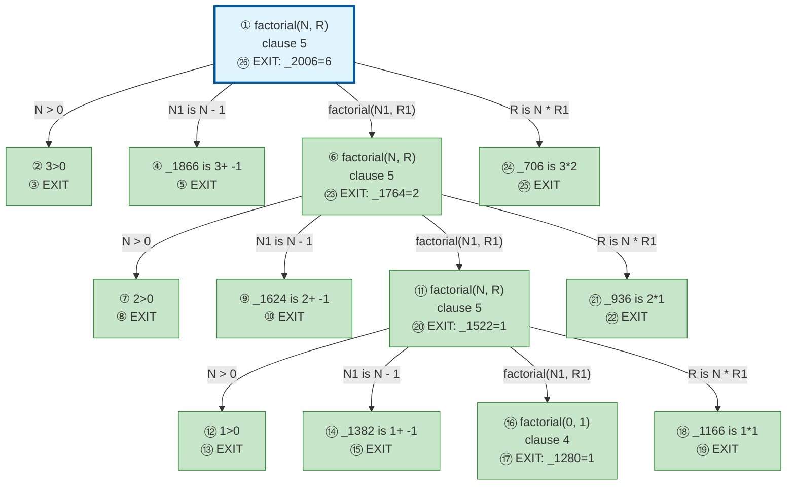

# Prolog Execution Trace: factorial(3, X)

## Query

```
factorial(3, X)
```

## Clause Definitions

| Line # | Clause |
|--------|--------|
| 4 | `factorial(0, 1)` |
| 5 | `factorial(N, R) :- N > 0, N1 is N - 1, factorial(N1, R1), R is N * R1` |

## Execution Timeline

┌─ Step 1: factorial(3,_2006)
│  
│  Clause: factorial(N, R) [line 5]
│  Unifications:
│    N = 3
│    R = _2006
│  Subgoals:
│    [1.1] N > 0
│    [1.2] N1 is N - 1
│    [1.3] factorial(N1, R1)
│    [1.4] R is N * R1
│  Result: 6
│  Query Variable: X = ?
└─

┌─ Step 24: _706 is 3*2
│  ◀── Solving subgoal [1.1]
└─

┌─ Step 21: _936 is 2*1
└─

┌─ Step 18: _1166 is 1*1
└─


## Call Tree



## Final Answer

```
X = 6
```

_Showing first solution only._