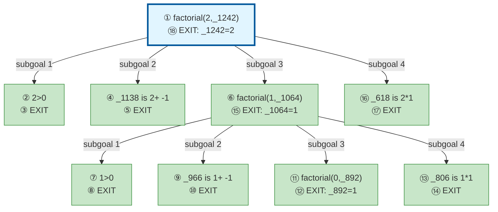

# Prolog Execution Trace: factorial(2, F)

## Query

```
factorial(2, F)
```

## Clause Definitions

| Line # | Clause |
|--------|--------|
| 4 | `factorial(0, 1)` |
| 5 | `factorial(N, R) :- N > 0, N1 is N - 1, factorial(N1, R1), R is N * R1` |

## Execution Timeline

┌─ Step 1: CALL factorial(2,_1242)
│  
│  Pattern Match:
│    Goal: factorial(2,_1242)
│    Head: factorial(_488,_490)
│    ├─ _488 = 2
│    ├─ _490 = _1242
│  
│  Clause: factorial(_488,_490) :- _488>0,_512 is _488+ -1,factorial(_512,_532),_490 is _488*_532 [line 9]
│  Spawns subgoals:
│    [1.1] _488>0
│    [1.2] _512 is _488+ -1
│    [1.3] factorial(_512,_532)
│    [1.4] _490 is _488*_532
└─

┌─ Step 2: CALL 2>0
└─

┌─ Step 3: EXIT 2>0
│  Returns to: Step 2
└─

┌─ Step 4: CALL _1138 is 2+ -1
└─

┌─ Step 5: EXIT 1 is 2+ -1
│  Returns to: Step 4
└─

┌─ Step 6: CALL factorial(1,_1064)
│  
│  Pattern Match:
│    Goal: factorial(1,_1064)
│    Head: factorial(_676,_678)
│    ├─ _676 = 1
│    ├─ _678 = _1064
│  
│  Clause: factorial(_676,_678) :- _676>0,_700 is _676+ -1,factorial(_700,_720),_678 is _676*_720 [line 9]
│  Spawns subgoals:
│    [6.1] _676>0
│    [6.2] _700 is _676+ -1
│    [6.3] factorial(_700,_720)
│    [6.4] _678 is _676*_720
└─

┌─ Step 7: CALL 1>0
└─

┌─ Step 8: EXIT 1>0
│  Returns to: Step 7
└─

┌─ Step 9: CALL _966 is 1+ -1
└─

┌─ Step 10: EXIT 0 is 1+ -1
│  Returns to: Step 9
└─

┌─ Step 11: CALL factorial(0,_892)
│  
│  Pattern Match:
│    Goal: factorial(0,_892)
│    Head: factorial(0,1)
│  
│  Clause: factorial(0,1) [line 8] (fact)
└─

┌─ Step 12: EXIT factorial(0,1)
│  Bindings:
│    _892 = 1
│  Returns to: Step 11
└─

┌─ Step 13: CALL _806 is 1*1
└─

┌─ Step 14: EXIT 1 is 1*1
│  Returns to: Step 13
└─

┌─ Step 15: EXIT factorial(1,1)
│  Bindings:
│    _1064 = 1
│  Returns to: Step 6
└─

┌─ Step 16: CALL _618 is 2*1
└─

┌─ Step 17: EXIT 2 is 2*1
│  Returns to: Step 16
└─

┌─ Step 18: EXIT factorial(2,2)
│  Bindings:
│    _1242 = 2
│  Returns to: Step 1
└─


## Call Tree



## Final Answer

```
F = 2
```

_Showing first solution only._