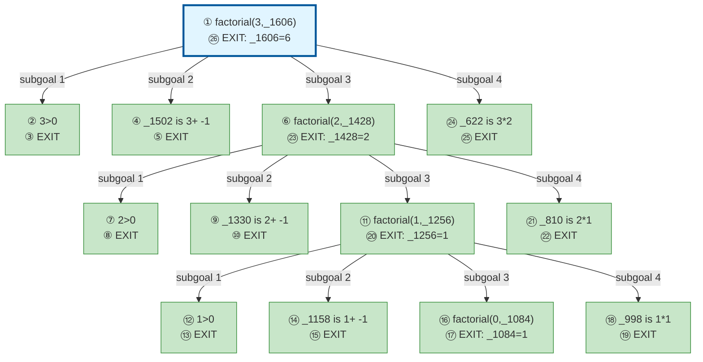

# Prolog Execution Trace: factorial(3, X)

## Query

```
factorial(3, X)
```

## Clause Definitions

| Line # | Clause |
|--------|--------|
| 4 | `factorial(0, 1)` |
| 5 | `factorial(N, R) :- N > 0, N1 is N - 1, factorial(N1, R1), R is N * R1` |

## Execution Timeline

┌─ Step 1: CALL factorial(3,_1606)
│  
│  Pattern Match:
│    Goal: factorial(3,_1606)
│    Head: factorial(N, R)
│    ├─ N = 3
│    ├─ R = _1606
│  
│  Clause: factorial(N, R) :- N > 0, N1 is N - 1, factorial(N1, R1), R is N * R1 [line 5]
│  Spawns subgoals:
│    [1.1] N > 0
│    [1.2] N1 is N - 1
│    [1.3] factorial(N1, R1)
│    [1.4] R is N * R1
└─

┌─ Step 2: CALL 3>0
│  ◀── Solving subgoal [1.1]
└─

┌─ Step 3: EXIT 3>0
│  ◀── Completed subgoal [1.1]
│  Returns to: Step 2
│  Next: Subgoal [1.2]
└─

┌─ Step 4: CALL _1502 is 3+ -1
│  ◀── Solving subgoal [1.2]
└─

┌─ Step 5: EXIT 2 is 3+ -1
│  ◀── Completed subgoal [1.2]
│  Returns to: Step 4
│  Next: Subgoal [1.3]
└─

┌─ Step 6: CALL factorial(2,_1428)
│  ◀── Solving subgoal [1.3]
│  
│  Pattern Match:
│    Goal: factorial(2,_1428)
│    Head: factorial(N, R)
│    ├─ N = 2
│    ├─ R = _1428
│  
│  Clause: factorial(N, R) :- N > 0, N1 is N - 1, factorial(N1, R1), R is N * R1 [line 5]
│  Spawns subgoals:
│    [6.1] N > 0
│    [6.2] N1 is N - 1
│    [6.3] factorial(N1, R1)
│    [6.4] R is N * R1
└─

┌─ Step 7: CALL 2>0
│  ◀── Solving subgoal [6.1]
└─

┌─ Step 8: EXIT 2>0
│  ◀── Completed subgoal [6.1]
│  Returns to: Step 7
│  Next: Subgoal [6.2]
└─

┌─ Step 9: CALL _1330 is 2+ -1
│  ◀── Solving subgoal [6.2]
└─

┌─ Step 10: EXIT 1 is 2+ -1
│  ◀── Completed subgoal [6.2]
│  Returns to: Step 9
│  Next: Subgoal [6.3]
└─

┌─ Step 11: CALL factorial(1,_1256)
│  ◀── Solving subgoal [6.3]
│  
│  Pattern Match:
│    Goal: factorial(1,_1256)
│    Head: factorial(N, R)
│    ├─ N = 1
│    ├─ R = _1256
│  
│  Clause: factorial(N, R) :- N > 0, N1 is N - 1, factorial(N1, R1), R is N * R1 [line 5]
│  Spawns subgoals:
│    [11.1] N > 0
│    [11.2] N1 is N - 1
│    [11.3] factorial(N1, R1)
│    [11.4] R is N * R1
└─

┌─ Step 12: CALL 1>0
│  ◀── Solving subgoal [11.1]
└─

┌─ Step 13: EXIT 1>0
│  ◀── Completed subgoal [11.1]
│  Returns to: Step 12
│  Next: Subgoal [11.2]
└─

┌─ Step 14: CALL _1158 is 1+ -1
│  ◀── Solving subgoal [11.2]
└─

┌─ Step 15: EXIT 0 is 1+ -1
│  ◀── Completed subgoal [11.2]
│  Returns to: Step 14
│  Next: Subgoal [11.3]
└─

┌─ Step 16: CALL factorial(0,_1084)
│  ◀── Solving subgoal [11.3]
│  
│  Pattern Match:
│    Goal: factorial(0,_1084)
│    Head: factorial(0, 1)
│  
│  Clause: factorial(0, 1) [line 4] (fact)
└─

┌─ Step 17: EXIT factorial(0,1)
│  ◀── Completed subgoal [11.3]
│  Bindings:
│    _1084 = 1
│  Returns to: Step 16
│  Next: Subgoal [11.4]
└─

┌─ Step 18: CALL _998 is 1*1
│  ◀── Solving subgoal [11.4]
└─

┌─ Step 19: EXIT 1 is 1*1
│  ◀── Completed subgoal [11.4]
│  Returns to: Step 18
└─

┌─ Step 20: EXIT factorial(1,1)
│  ◀── Completed subgoal [6.3]
│  Bindings:
│    _1256 = 1
│  Returns to: Step 11
│  Next: Subgoal [6.4]
└─

┌─ Step 21: CALL _810 is 2*1
│  ◀── Solving subgoal [6.4]
└─

┌─ Step 22: EXIT 2 is 2*1
│  ◀── Completed subgoal [6.4]
│  Returns to: Step 21
└─

┌─ Step 23: EXIT factorial(2,2)
│  ◀── Completed subgoal [1.3]
│  Bindings:
│    _1428 = 2
│  Returns to: Step 6
│  Next: Subgoal [1.4]
└─

┌─ Step 24: CALL _622 is 3*2
│  ◀── Solving subgoal [1.4]
└─

┌─ Step 25: EXIT 6 is 3*2
│  ◀── Completed subgoal [1.4]
│  Returns to: Step 24
└─

┌─ Step 26: EXIT factorial(3,6)
│  Bindings:
│    _1606 = 6
│  Returns to: Step 1
└─


## Call Tree



## Final Answer

```
X = 6
```

_Showing first solution only._