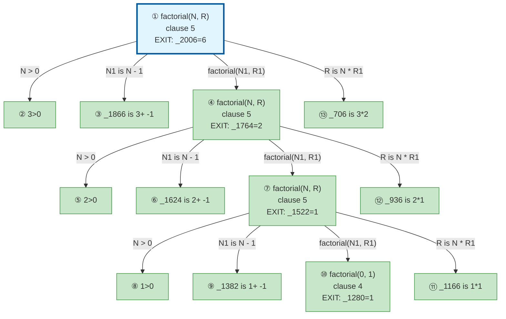

# Prolog Execution Trace: factorial(3, X)

## Query

```
factorial(3, X)
```

## Clause Definitions

| Line # | Clause |
|--------|--------|
| 4 | `factorial(0, 1)` |
| 5 | `factorial(N, R) :- N > 0, N1 is N - 1, factorial(N1, R1), R is N * R1` |

## Execution Timeline

┌─ Step 1: factorial(3,_2006)
│  
│  Clause: factorial(N, R) [line 5]
│  Unifications:
│    N = 3
│    R = _2006
│  Subgoals:
│    [1.1] N > 0 → 3 > 0
│    [1.2] N1 is N - 1 → N1 is 3 - 1
│    [1.3] factorial(N1, R1)
│    [1.4] R is N * R1 → _2006 is 3 * R1
│  Result: 6
│  Query Variable: X = 6
└─

┌─ Step 2: 3>0
│  ◀── Solving subgoal [1.1]
└─

┌─ Step 3: _1866 is 3+ -1
│  ◀── Solving subgoal [1.2]
└─

┌─ Step 4: factorial(2,_1764)
│  ◀── Solving subgoal [1.3]
│  
│  Clause: factorial(N, R) [line 5]
│  Unifications:
│    N = 2
│    R = _1764
│  Subgoals:
│    [4.1] N > 0 → 2 > 0
│    [4.2] N1 is N - 1 → N1 is 2 - 1
│    [4.3] factorial(N1, R1)
│    [4.4] R is N * R1 → _1764 is 2 * R1
│  Result: 2
│  Query Variable: X = ?
└─

┌─ Step 5: 2>0
│  ◀── Solving subgoal [4.1]
└─

┌─ Step 6: _1624 is 2+ -1
└─

┌─ Step 7: factorial(1,_1522)
│  
│  Clause: factorial(N, R) [line 5]
│  Unifications:
│    N = 1
│    R = _1522
│  Subgoals:
│    [7.1] N > 0 → 1 > 0
│    [7.2] N1 is N - 1 → N1 is 1 - 1
│    [7.3] factorial(N1, R1)
│    [7.4] R is N * R1 → _1522 is 1 * R1
│  Result: 1
│  Query Variable: X = ?
└─

┌─ Step 8: 1>0
│  ◀── Solving subgoal [7.1]
└─

┌─ Step 9: _1382 is 1+ -1
└─

┌─ Step 10: factorial(0,_1280)
│  
│  Fact: factorial(0, 1) [line 4]
│  Result: 1
│  Query Variable: X = ?
└─

┌─ Step 11: _1166 is 1*1
└─

┌─ Step 12: _936 is 2*1
└─

┌─ Step 13: _706 is 3*2
│  ◀── Solving subgoal [1.4]
└─


## Call Tree



## Final Answer

```
X = 6
```

_Showing first solution only._