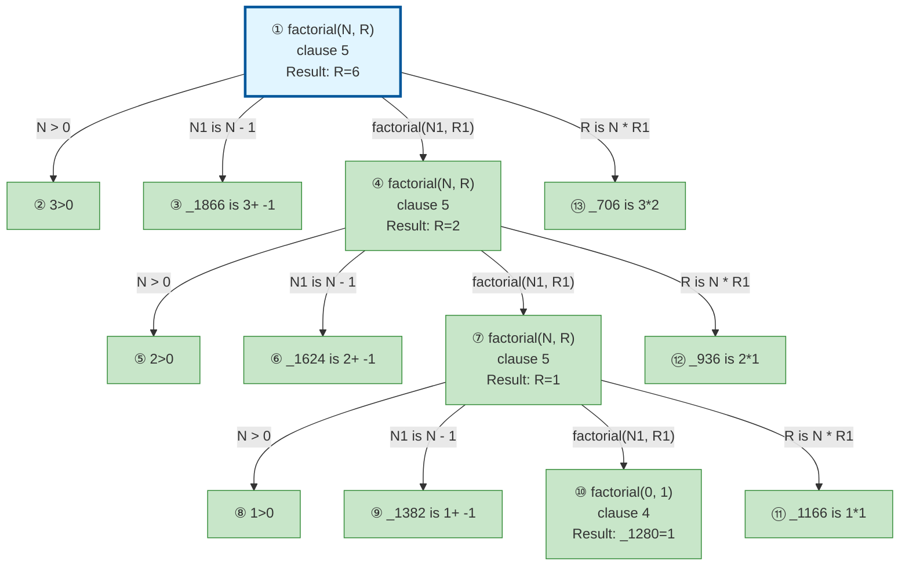

# Prolog Execution Trace: factorial(3, X)

## Query

```
factorial(3, X)
```

## Clause Definitions

| Line # | Clause |
|--------|--------|
| 4 | `factorial(0, 1)` |
| 5 | `factorial(N, R) :- N > 0, N1 is N - 1, factorial(N1, R1), R is N * R1` |

## Execution Timeline

┌─ Step 1: factorial(3,R)
│  Clause: factorial(N, R) [line 5]
│  Unifications:
│    N = 3
│    R = _2006
│  Subgoals:
│    [1.1] N > 0 → 3 > 0
│    [1.2] N1 is N - 1 → N1 is 3 - 1
│    [1.3] factorial(N1, R1)
│    [1.4] R is N * R1 → _2006 is 3 * R1
│  
│  ┌─ Step 2 [Goal 1.1]: 3>0
│  │  => ? = 3>0
│  └─
│  ┌─ Step 3 [Goal 1.2]: _1866 is 3+ -1
│  │  => ? = 2 is 3+ -1
│  └─
│  ┌─ Step 4 [Goal 1.3]: factorial(2,R)
│  │  Clause: factorial(N, R) [line 5]
│  │  Unifications:
│  │    N = 2
│  │    R = _1764
│  │  Subgoals:
│  │    [4.1] N > 0 → 2 > 0
│  │    [4.2] N1 is N - 1 → N1 is 2 - 1
│  │    [4.3] factorial(N1, R1)
│  │    [4.4] R is N * R1 → _1764 is 2 * R1
│  │  
│  │  ┌─ Step 5 [Goal 4.1]: 2>0
│  │  │  => ? = 2>0
│  │  └─
│  │  ┌─ Step 6 [Goal 4.2]: _1624 is 2+ -1
│  │  │  => ? = 1 is 2+ -1
│  │  └─
│  │  ┌─ Step 7 [Goal 4.3]: factorial(1,R)
│  │  │  Clause: factorial(N, R) [line 5]
│  │  │  Unifications:
│  │  │    N = 1
│  │  │    R = _1522
│  │  │  Subgoals:
│  │  │    [7.1] N > 0 → 1 > 0
│  │  │    [7.2] N1 is N - 1 → N1 is 1 - 1
│  │  │    [7.3] factorial(N1, R1)
│  │  │    [7.4] R is N * R1 → _1522 is 1 * R1
│  │  │  
│  │  │  ┌─ Step 8 [Goal 7.1]: 1>0
│  │  │  │  => ? = 1>0
│  │  │  └─
│  │  │  ┌─ Step 9 [Goal 7.2]: _1382 is 1+ -1
│  │  │  │  => ? = 0 is 1+ -1
│  │  │  └─
│  │  │  ┌─ Step 10 [Goal 7.3]: factorial(0,_1280)
│  │  │  │  Fact: factorial(0, 1) [line 4]
│  │  │  │  => _1280 = 1
│  │  │  └─
│  │  │  ┌─ Step 11 [Goal 7.4]: R is N * R1 → _1166 is 1*1
│  │  │  │  where R1 = 1 (from Step 10)
│  │  │  │  => ? = 1 is 1*1
│  │  │  └─
│  │  │  => R = 1
│  │  └─
│  │  ┌─ Step 12 [Goal 4.4]: R is N * R1 → _936 is 2*1
│  │  │  where R1 = 1 (from Step 7)
│  │  │  => ? = 2 is 2*1
│  │  └─
│  │  => R = 2
│  └─
│  ┌─ Step 13 [Goal 1.4]: R is N * R1 → _706 is 3*2
│  │  where R1 = 2 (from Step 4)
│  │  => ? = 6 is 3*2
│  └─
│  => R = 6
│  Query Variable: X = 6
└─


## Call Tree



## Final Answer

```
X = 6
```

_Showing first solution only._