# Prolog Execution Tree: factorial(5, X)

## Query

```prolog
factorial(5, X)
```

## Clauses Defined

1. `factorial(0, 1)`
2. `factorial(N, R) :- N > 0, N1 is N - 1, factorial(N1, R1), R is N * R1`

## Search Tree Visualization

```mermaid
graph TD

%% Nodes
A[["🎯 QUERY<br/>factorial(5, X₀)"]]
B["🔄 Solve: 5>0, N1₀ is 5-1"]
C["🔄 Solve: N1₀ is 5-1"]
D("✅ Solved: N1₀ = 4")
E["🔄 🔁 Recurse: factorial(4, R1₀) [clause 2]"]
F("✅ Solved: N1₀ = 4")
G["🔄 Solve: 4>0, N1₁ is 4-1"]
H["🔄 Solve: N1₁ is 4-1"]
I("✅ Solved: N1₁ = 3")
J["🔄 🔁 Recurse: factorial(3, R1₁) [clause 2]"]
K("✅ Solved: N1₁ = 3")
L["🔄 Solve: 3>0, N1₂ is 3-1"]
M["🔄 Solve: N1₂ is 3-1"]
N("✅ Solved: N1₂ = 2")
O["🔄 🔁 Recurse: factorial(2, R1₂) [clause 2]"]
P("✅ Solved: N1₂ = 2")
Q["🔄 Solve: 2>0, N1₃ is 2-1"]
R["🔄 Solve: N1₃ is 2-1"]
S("✅ Solved: N1₃ = 1")
T["🔄 🔁 Recurse: factorial(1, R1₃) [clause 2]"]
U("✅ Solved: N1₃ = 1")
V["🔄 Solve: 1>0, N1₄ is 1-1"]
W["🔄 Solve: N1₄ is 1-1"]
X("✅ Solved: N1₄ = 0")

%% Edges
A -->|"① clause 2"| B
B -->|"②"| C
C -->|"③ N1₀ = 4"| D
D -->|"④ clause 2"| E
E -->|"⑤ N1₀ = 4"| F
F -->|"⑥ clause 2"| G
G -->|"⑦"| H
H -->|"⑧ N1₁ = 3"| I
I -->|"⑨ clause 2"| J
J -->|"⑩ N1₁ = 3"| K
K -->|"⑪ clause 2"| L
L -->|"⑫"| M
M -->|"⑬ N1₂ = 2"| N
N -->|"⑭ clause 2"| O
O -->|"⑮ N1₂ = 2"| P
P -->|"⑯ clause 2"| Q
Q -->|"⑰"| R
R -->|"⑱ N1₃ = 1"| S
S -->|"⑲ clause 2"| T
T -->|"⑳ N1₃ = 1"| U
U -->|"(21) clause 2"| V
V -->|"(22)"| W
W -->|"(23) N1₄ = 0"| X

%% Styles
style A fill:#e1f5ff,stroke:#01579b,stroke-width:3px
style B fill:#fff9c4,stroke:#f57f17
style C fill:#fff9c4,stroke:#f57f17
style D fill:#c8e6c9,stroke:#388e3c
style E fill:#fff9c4,stroke:#f57f17
style F fill:#c8e6c9,stroke:#388e3c
style G fill:#fff9c4,stroke:#f57f17
style H fill:#fff9c4,stroke:#f57f17
style I fill:#c8e6c9,stroke:#388e3c
style J fill:#fff9c4,stroke:#f57f17
style K fill:#c8e6c9,stroke:#388e3c
style L fill:#fff9c4,stroke:#f57f17
style M fill:#fff9c4,stroke:#f57f17
style N fill:#c8e6c9,stroke:#388e3c
style O fill:#fff9c4,stroke:#f57f17
style P fill:#c8e6c9,stroke:#388e3c
style Q fill:#fff9c4,stroke:#f57f17
style R fill:#fff9c4,stroke:#f57f17
style S fill:#c8e6c9,stroke:#388e3c
style T fill:#fff9c4,stroke:#f57f17
style U fill:#c8e6c9,stroke:#388e3c
style V fill:#fff9c4,stroke:#f57f17
style W fill:#fff9c4,stroke:#f57f17
style X fill:#c8e6c9,stroke:#388e3c
```



### Legend

- 🎯 **Blue**: Initial query
- 🔄 **Yellow**: Currently solving goal
- 📦 **Orange**: Clause match with unifications
- ⏸️ **Gray**: Pending goals (waiting for current goal to complete)
- ✅ **Green**: Solved goal with binding
- 🎉 **Green**: Final success
- **Solid arrows**: Active execution flow
- **Dashed arrows**: Goals queued for later
- **Double arrows (green)**: Pending goal becomes active

## Step-by-Step Execution

### Step 1

**Goal:** `5>0,N1₀ is 5-1`

**Action:** Solving 5>0,N1₀ is 5-1

### Step 2

**Goal:** `N1₀ is 5-1`

**Action:** Solving N1₀ is 5-1

**Clause matched:** `N1₀/4`

### Step 4

**Goal:** `factorial(4,R1₀)`

**Action:** Solving factorial(4,R1₀)

**Clause matched:** `N1₀/4`

### Step 6

**Goal:** `4>0,N1₁ is 4-1`

**Action:** Solving 4>0,N1₁ is 4-1

### Step 7

**Goal:** `N1₁ is 4-1`

**Action:** Solving N1₁ is 4-1

**Clause matched:** `N1₁/3`

### Step 9

**Goal:** `factorial(3,R1₁)`

**Action:** Solving factorial(3,R1₁)

**Clause matched:** `N1₁/3`

### Step 11

**Goal:** `3>0,N1₂ is 3-1`

**Action:** Solving 3>0,N1₂ is 3-1

### Step 12

**Goal:** `N1₂ is 3-1`

**Action:** Solving N1₂ is 3-1

**Clause matched:** `N1₂/2`

### Step 14

**Goal:** `factorial(2,R1₂)`

**Action:** Solving factorial(2,R1₂)

**Clause matched:** `N1₂/2`

### Step 16

**Goal:** `2>0,N1₃ is 2-1`

**Action:** Solving 2>0,N1₃ is 2-1

### Step 17

**Goal:** `N1₃ is 2-1`

**Action:** Solving N1₃ is 2-1

**Clause matched:** `N1₃/1`

### Step 19

**Goal:** `factorial(1,R1₃)`

**Action:** Solving factorial(1,R1₃)

**Clause matched:** `N1₃/1`

### Step 21

**Goal:** `1>0,N1₄ is 1-1`

**Action:** Solving 1>0,N1₄ is 1-1

### Step 22

**Goal:** `N1₄ is 1-1`

**Action:** Solving N1₄ is 1-1

**Clause matched:** `N1₄/0`


## Final Answer

Query succeeded with no bindings.