# Prolog Execution Tree: factorial(3, X)

## Query

```prolog
factorial(3, X)
```

## Clauses Defined

| Line # | Clause |
|--------|--------|
| 4 | `factorial(0, 1)` |
| 5 | `factorial(N, R) :- N > 0, N1 is N - 1, factorial(N1, R1), R is N * R1` |

## Search Tree Visualization

```mermaid
graph TD

%% Nodes
A[["🎯 QUERY<br/>factorial(3, X)"]]
B("✅ Solved: X = 6")
C["🔄 Solve: 3>0"]
D(("🎉 SUCCESS"))
E["🔄 Solve: _1534 is 3+ -1"]
F(("🎉 SUCCESS"))
G["🔄 🔁 Recurse: factorial(2, _1460) [clause 5]"]
H["🔄 Solve: 2>0"]
I(("🎉 SUCCESS"))
J["🔄 Solve: _1362 is 2+ -1"]
K(("🎉 SUCCESS"))
L["🔄 🔁 Recurse: factorial(1, _1288) [clause 5]"]
M["🔄 Solve: 1>0"]
N(("🎉 SUCCESS"))
O["🔄 Solve: _1190 is 1+ -1"]
P(("🎉 SUCCESS"))
Q["🔄 🔁 Recurse: factorial(0, _1116) [clause 4]"]
R(("🎉 SUCCESS"))
S["🔄 Solve: _1030 is 1*1"]
T(("🎉 SUCCESS"))
U["🔄 Solve: _842 is 2*1"]
V(("🎉 SUCCESS"))
W["🔄 Solve: _654 is 3*2"]
X(("🎉 SUCCESS"))

%% Edges
A -->|"① X = 6"| B
B -->|"② done"| C
C -->|"③ success"| D
B -->|"④"| E
E -->|"⑤"| F
B -->|"⑥ clause 9"| G
G -->|"⑦"| H
H -->|"⑧"| I
G -->|"⑨ backtrack"| J
J -->|"⑩"| K
G -->|"⑪ backtrack (clause 9)"| L
L -->|"⑫"| M
M -->|"⑬"| N
L -->|"⑭ backtrack"| O
O -->|"⑮"| P
L -->|"⑯ backtrack (clause 8)"| Q
Q -->|"⑰"| R
L -->|"⑱ backtrack"| S
S -->|"⑲"| T
G -->|"⑳ backtrack"| U
U -->|"(21)"| V
B -->|"(22)"| W
W -->|"(23)"| X

%% Styles
style A fill:#e1f5ff,stroke:#01579b,stroke-width:3px
style B fill:#c8e6c9,stroke:#388e3c
style C fill:#fff9c4,stroke:#f57f17
style D fill:#c8e6c9,stroke:#2e7d32,stroke-width:3px
style E fill:#fff9c4,stroke:#f57f17
style F fill:#c8e6c9,stroke:#2e7d32,stroke-width:3px
style G fill:#fff9c4,stroke:#f57f17
style H fill:#fff9c4,stroke:#f57f17
style I fill:#c8e6c9,stroke:#2e7d32,stroke-width:3px
style J fill:#fff9c4,stroke:#f57f17
style K fill:#c8e6c9,stroke:#2e7d32,stroke-width:3px
style L fill:#fff9c4,stroke:#f57f17
style M fill:#fff9c4,stroke:#f57f17
style N fill:#c8e6c9,stroke:#2e7d32,stroke-width:3px
style O fill:#fff9c4,stroke:#f57f17
style P fill:#c8e6c9,stroke:#2e7d32,stroke-width:3px
style Q fill:#fff9c4,stroke:#f57f17
style R fill:#c8e6c9,stroke:#2e7d32,stroke-width:3px
style S fill:#fff9c4,stroke:#f57f17
style T fill:#c8e6c9,stroke:#2e7d32,stroke-width:3px
style U fill:#fff9c4,stroke:#f57f17
style V fill:#c8e6c9,stroke:#2e7d32,stroke-width:3px
style W fill:#fff9c4,stroke:#f57f17
style X fill:#c8e6c9,stroke:#2e7d32,stroke-width:3px
```



### Legend

- 🎯 **Blue**: Initial query
- 🔄 **Yellow**: Currently solving goal
- 📦 **Orange**: Clause match with unifications
- ⏸️ **Gray**: Pending goals (waiting for current goal to complete)
- ✅ **Green**: Solved goal with binding
- 🎉 **Green**: Final success
- **Solid arrows**: Active execution flow
- **Dashed arrows**: Goals queued for later
- **Double arrows (green)**: Pending goal becomes active

## Step-by-Step Execution

### Step 2

**Goal:** `3>0`

**Action:** Solving 3>0

### Step 3

**Goal:** `true`

**Action:** Solving true

### Step 4

**Goal:** `_1534 is 3+ -1`

**Action:** Backtracking: _1534 is 3+ -1

### Step 5

**Goal:** `true`

**Action:** Solving true

### Step 6

**Goal:** `factorial(2,_1460)`

**Action:** Backtracking: factorial(2,_1460)

### Step 7

**Goal:** `2>0`

**Action:** Solving 2>0

### Step 8

**Goal:** `true`

**Action:** Solving true

### Step 9

**Goal:** `_1362 is 2+ -1`

**Action:** Solving _1362 is 2+ -1

### Step 10

**Goal:** `true`

**Action:** Solving true

### Step 11

**Goal:** `factorial(1,_1288)`

**Action:** Solving factorial(1,_1288)

### Step 12

**Goal:** `1>0`

**Action:** Solving 1>0

### Step 13

**Goal:** `true`

**Action:** Solving true

### Step 14

**Goal:** `_1190 is 1+ -1`

**Action:** Solving _1190 is 1+ -1

### Step 15

**Goal:** `true`

**Action:** Solving true

### Step 16

**Goal:** `factorial(0,_1116)`

**Action:** Solving factorial(0,_1116)

### Step 17

**Goal:** `true`

**Action:** Solving true

### Step 18

**Goal:** `_1030 is 1*1`

**Action:** Solving _1030 is 1*1

### Step 19

**Goal:** `true`

**Action:** Solving true

### Step 20

**Goal:** `_842 is 2*1`

**Action:** Solving _842 is 2*1

### Step 21

**Goal:** `true`

**Action:** Solving true

### Step 22

**Goal:** `_654 is 3*2`

**Action:** Backtracking: _654 is 3*2

### Step 23

**Goal:** `true`

**Action:** Solving true


## Final Answer

Query succeeded with no bindings.