# Prolog Execution Tree: factorial(3, X)

## Query

```prolog
factorial(3, X)
```

## Clauses Defined

1. `factorial(0, 1)`
2. `factorial(N, R) :- N > 0, N1 is N - 1, factorial(N1, R1), R is N * R1`

## Search Tree Visualization

```mermaid
graph TD

%% Nodes
A[["🎯 QUERY<br/>factorial(3, X₀)"]]
B["🔄 Solve: 3>0, N1₀ is 3-1"]
C["🔄 Solve: N1₀ is 3-1"]
D("✅ Solved: N1₀ = 2")
E["🔄 🔁 Recurse: factorial(2, R1₀) [clause 2]"]
F("✅ Solved: N1₀ = 2")
G["🔄 Solve: 2>0, N1₁ is 2-1"]
H["🔄 Solve: N1₁ is 2-1"]
I("✅ Solved: N1₁ = 1")
J["🔄 🔁 Recurse: factorial(1, R1₁) [clause 2]"]
K("✅ Solved: N1₁ = 1")
L["🔄 Solve: 1>0, N1₂ is 1-1"]
M["🔄 Solve: N1₂ is 1-1"]
N("✅ Solved: N1₂ = 0")
O["🔄 🔁 Recurse: factorial(0, R1₂) [clause 1]"]
P("✅ Solved: R1₂ = 1")
Q["🔄 Solve: R1₁ is 1*1"]
R("✅ Solved: R1₁ = 1")
S["🔄 Solve: R1₀ is 2*1"]
T("✅ Solved: R1₀ = 2")
U["🔄 Solve: X₀ is 3*2"]
V("✅ Solved: X₀ = 6")
W(("🎉 SUCCESS<br/>Result = true"))
X["🔄 Solve: 0>0, N1₃ is 0-1"]
Y["🔄 Solve: false"]

%% Edges
A -->|"① clause 2"| B
B -->|"②"| C
C -->|"③ N1₀ = 2"| D
D -->|"④ clause 2"| E
E -->|"⑤ N1₀ = 2"| F
F -->|"⑥ clause 2"| G
G -->|"⑦"| H
H -->|"⑧ N1₁ = 1"| I
I -->|"⑨ clause 2"| J
J -->|"⑩ N1₁ = 1"| K
K -->|"⑪ clause 2"| L
L -->|"⑫"| M
M -->|"⑬ N1₂ = 0"| N
N -->|"⑭ clause 1"| O
O -->|"⑮ R1₂ = 1"| P
P -->|"⑯ clause 1"| Q
Q -->|"⑰ R1₁ = 1"| R
R -->|"⑱ done"| S
S -->|"⑲ R1₀ = 2"| T
T -->|"⑳ done"| U
U -->|"(21) X₀ = 6"| V
V -->|"(22) all done"| W
P -->|"(23) backtrack (clause 2)"| X
X -->|"(24)"| Y

%% Styles
style A fill:#e1f5ff,stroke:#01579b,stroke-width:3px
style B fill:#fff9c4,stroke:#f57f17
style C fill:#fff9c4,stroke:#f57f17
style D fill:#c8e6c9,stroke:#388e3c
style E fill:#fff9c4,stroke:#f57f17
style F fill:#c8e6c9,stroke:#388e3c
style G fill:#fff9c4,stroke:#f57f17
style H fill:#fff9c4,stroke:#f57f17
style I fill:#c8e6c9,stroke:#388e3c
style J fill:#fff9c4,stroke:#f57f17
style K fill:#c8e6c9,stroke:#388e3c
style L fill:#fff9c4,stroke:#f57f17
style M fill:#fff9c4,stroke:#f57f17
style N fill:#c8e6c9,stroke:#388e3c
style O fill:#fff9c4,stroke:#f57f17
style P fill:#c8e6c9,stroke:#388e3c
style Q fill:#fff9c4,stroke:#f57f17
style R fill:#c8e6c9,stroke:#388e3c
style S fill:#fff9c4,stroke:#f57f17
style T fill:#c8e6c9,stroke:#388e3c
style U fill:#fff9c4,stroke:#f57f17
style V fill:#c8e6c9,stroke:#388e3c
style W fill:#c8e6c9,stroke:#2e7d32,stroke-width:3px
style X fill:#fff9c4,stroke:#f57f17
style Y fill:#fff9c4,stroke:#f57f17
```



### Legend

- 🎯 **Blue**: Initial query
- 🔄 **Yellow**: Currently solving goal
- ⏸️ **Gray**: Pending goals (waiting for current goal to complete)
- ✅ **Green**: Solved goal with binding
- 🎉 **Green**: Final success
- **Solid arrows**: Active execution flow
- **Dashed arrows**: Goals queued for later
- **Double arrows (green)**: Pending goal becomes active

## Step-by-Step Execution

### Step 1

**Goal:** `3>0,N1₀ is 3-1`

**Action:** Solving 3>0,N1₀ is 3-1

### Step 2

**Goal:** `N1₀ is 3-1`

**Action:** Solving N1₀ is 3-1

**Clause matched:** `N1₀/2`

### Step 4

**Goal:** `factorial(2,R1₀)`

**Action:** Solving factorial(2,R1₀)

**Clause matched:** `N1₀/2`

### Step 6

**Goal:** `2>0,N1₁ is 2-1`

**Action:** Solving 2>0,N1₁ is 2-1

### Step 7

**Goal:** `N1₁ is 2-1`

**Action:** Solving N1₁ is 2-1

**Clause matched:** `N1₁/1`

### Step 9

**Goal:** `factorial(1,R1₁)`

**Action:** Solving factorial(1,R1₁)

**Clause matched:** `N1₁/1`

### Step 11

**Goal:** `1>0,N1₂ is 1-1`

**Action:** Solving 1>0,N1₂ is 1-1

### Step 12

**Goal:** `N1₂ is 1-1`

**Action:** Solving N1₂ is 1-1

**Clause matched:** `N1₂/0`

### Step 14

**Goal:** `factorial(0,R1₂)`

**Action:** Solving factorial(0,R1₂)

**Clause matched:** `R1₂/1`

### Step 16

**Goal:** `R1₁ is 1*1`

**Action:** Solving R1₁ is 1*1

**Clause matched:** `R1₁/1`

### Step 18

**Goal:** `R1₀ is 2*1`

**Action:** Solving R1₀ is 2*1

**Clause matched:** `R1₀/2`

### Step 20

**Goal:** `X₀ is 3*2`

**Action:** Solving X₀ is 3*2

**Clause matched:** `X₀/6`

### Step 22

**Goal:** `true`

**Action:** Solving true

### Step 23

**Goal:** `0>0,N1₃ is 0-1`

**Action:** Backtracking: 0>0,N1₃ is 0-1

### Step 24

**Goal:** `false`

**Action:** Solving false


## Final Answer

```prolog
X = 6
```