# Prolog Execution Tree: member(X, [a,b,c])

## Query

```prolog
member(X, [a,b,c])
```

## Clauses Defined

| Line # | Clause |
|--------|--------|
| 4 | `member(X, [X|_])` |
| 5 | `member(X, [_|T]) :- member(X, T)` |

## Search Tree Visualization

```mermaid
graph TD

%% Nodes
A[["🎯 QUERY<br/>member(X, [a, b, c])"]]
B["📦 Match Clause 5<br/>member(X, [_|T])<br/><br/>Unifications:<br/>• X = a"]
C("✅ Solved: X = a")
D(("🎉 SUCCESS"))

%% Edges
A -->|"① try"| B
A -->|"② X = a"| C
C -->|"③ all done"| D

%% Styles
style A fill:#e1f5ff,stroke:#01579b,stroke-width:3px
style B fill:#ffe0b2,stroke:#e65100
style C fill:#c8e6c9,stroke:#388e3c
style D fill:#c8e6c9,stroke:#2e7d32,stroke-width:3px
```



### Legend

- 🎯 **Blue**: Initial query
- 🔄 **Yellow**: Currently solving goal
- 📦 **Orange**: Clause match with unifications
- ⏸️ **Gray**: Pending goals (waiting for current goal to complete)
- ✅ **Green**: Solved goal with binding
- 🎉 **Green**: Final success
- **Solid arrows**: Active execution flow
- **Dashed arrows**: Goals queued for later
- **Double arrows (green)**: Pending goal becomes active

## Step-by-Step Execution

### Step 3

**Goal:** `true`

**Action:** Solving true


## Final Answer

Query succeeded with no bindings.