# Prolog Execution Tree: member(2, [1,2,3])

## Query

```prolog
member(2, [1,2,3])
```

## Clauses Defined

1. `member(X, [X|_])`
2. `member(X, [_|T]) :- member(X, T)`

## Search Tree Visualization

```mermaid
graph TD

%% Nodes
A[["🎯 QUERY<br/>member(2, [1, 2, 3])"]]
B["🔄 Solve: member(2, [2, 3]) [clause 2]"]
C(("🎉 SUCCESS"))
D["🔄 Solve: member(2, [3]) [clause 2]"]
E["🔄 Solve: member(2, []) [clause 2]"]
F["🔄 Solve: false"]

%% Edges
A -->|"① clause 2"| B
B -->|"② clause 1"| C
B -->|"③ backtrack (clause 2)"| D
D -->|"④ clause 2"| E
E -->|"⑤"| F

%% Styles
style A fill:#e1f5ff,stroke:#01579b,stroke-width:3px
style B fill:#fff9c4,stroke:#f57f17
style C fill:#c8e6c9,stroke:#2e7d32,stroke-width:3px
style D fill:#fff9c4,stroke:#f57f17
style E fill:#fff9c4,stroke:#f57f17
style F fill:#fff9c4,stroke:#f57f17
```



### Legend

- 🎯 **Blue**: Initial query
- 🔄 **Yellow**: Currently solving goal
- 📦 **Orange**: Clause match with unifications
- ⏸️ **Gray**: Pending goals (waiting for current goal to complete)
- ✅ **Green**: Solved goal with binding
- 🎉 **Green**: Final success
- **Solid arrows**: Active execution flow
- **Dashed arrows**: Goals queued for later
- **Double arrows (green)**: Pending goal becomes active

## Step-by-Step Execution

### Step 1

**Goal:** `member(2,[2,3])`

**Action:** Solving member(2,[2,3])

### Step 2

**Goal:** `true`

**Action:** Solving true

### Step 3

**Goal:** `member(2,[3])`

**Action:** Backtracking: member(2,[3])

### Step 4

**Goal:** `member(2,[])`

**Action:** Solving member(2,[])

### Step 5

**Goal:** `false`

**Action:** Solving false


## Final Answer

Query succeeded with no bindings.