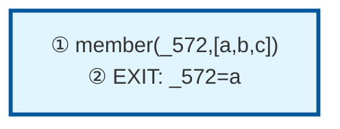

# Prolog Execution Trace: member(X, [a,b,c])

## Query

```
member(X, [a,b,c])
```

## Clause Definitions

| Line # | Clause |
|--------|--------|
| 4 | `member(X, [X|_])` |
| 5 | `member(X, [_|T]) :- member(X, T)` |

## Execution Timeline

┌─ Step 1: CALL member(_572,[a,b,c])
│  
│  Pattern Match:
│    Goal: member(_572,[a,b,c])
│    Head: member(X, [X|_])
│    ├─ X = _572
│    ├─ X = a
│    ├─ _ = [b,c]
│  
│  Clause: member(X, [X|_]) [line 4] (fact)
└─

┌─ Step 2: EXIT member(a,[a,b,c])
│  Bindings:
│    _572 = a
│  Returns to: Step 1
└─


## Call Tree



## Final Answer

```
X = a
```

_Showing first solution only._