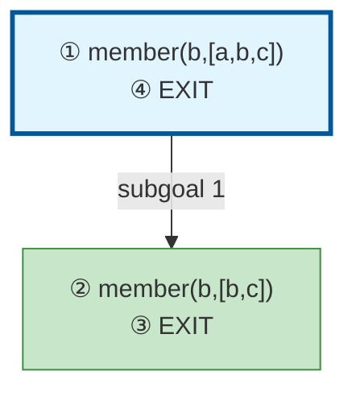

# Prolog Execution Trace: member(b, [a,b,c])

## Query

```
member(b, [a,b,c])
```

## Clause Definitions

| Line # | Clause |
|--------|--------|
| 4 | `member(X, [X|_])` |
| 5 | `member(X, [_|T]) :- member(X, T)` |

## Execution Timeline

┌─ Step 1: CALL member(b,[a,b,c])
│  
│  Pattern Match:
│    Goal: member(b,[a,b,c])
│    Head: member(_534,[_540|_542])
│    ├─ _534 = b
│  
│  Clause: member(_534,[_540|_542]) :- member(_534,_542) [line 9]
│  Spawns subgoals:
│    [1.1] member(_534,_542)
└─

┌─ Step 2: CALL member(b,[b,c])
│  
│  Pattern Match:
│    Goal: member(b,[b,c])
│    Head: member(_622,[_622|_630])
│    ├─ _622 = b
│  
│  Clause: member(_622,[_622|_630]) [line 8] (fact)
└─

┌─ Step 3: EXIT member(b,[b,c])
│  Returns to: Step 2
└─

┌─ Step 4: EXIT member(b,[a,b,c])
│  Returns to: Step 1
└─


## Call Tree



## Final Answer

Query succeeded with no bindings.

_Showing first solution only._