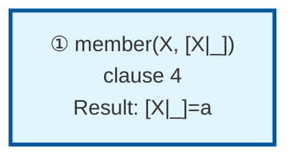

# Prolog Execution Trace: member(X, [a,b,c])

## Query

```
member(X, [a,b,c])
```

## Clause Definitions

| Line # | Clause |
|--------|--------|
| 4 | `member(X, [X|_])` |
| 5 | `member(X, [_|T]) :- member(X, T)` |

## Execution Timeline

┌─ Step 1: member(X,[a,b,c])
│  Fact: member(X, [X|_]) [line 4]
│  Unifications:
│    X = a
│    _ = [b,c]
│  => [X|_] = [a,b,c]
│  Query Variable: X = [a,b,c]
└─


## Call Tree



## Final Answer

```
X = a
```

_Showing first solution only._