# Prolog Execution Tree: member(X, [1,2,3])

## Query

```prolog
member(X, [1,2,3])
```

## Search Tree Visualization

```mermaid
graph TD

%% Nodes
A[["🎯 QUERY<br/>member(X₀, [1, 2, 3])"]]
B(("🎉 SUCCESS"))
C["🔄 Solve: member(X₀, [2, 3])"]
D(("🎉 SUCCESS"))
E["🔄 Solve: member(X₀, [3])"]
F(("🎉 SUCCESS"))
G["🔄 Solve: member(X₀, [])"]
H["🔄 Solve: false"]

%% Edges
A -->|"① clause 1"| B
A -->|"② backtrack"| C
C -->|"③ recurse"| D
C -->|"④ recurse"| E
E -->|"⑤ recurse"| F
E -->|"⑥ recurse"| G
G -->|"⑦ recurse"| H

%% Styles
style A fill:#e1f5ff,stroke:#01579b,stroke-width:3px
style B fill:#c8e6c9,stroke:#2e7d32,stroke-width:3px
style C fill:#fff9c4,stroke:#f57f17
style D fill:#c8e6c9,stroke:#2e7d32,stroke-width:3px
style E fill:#fff9c4,stroke:#f57f17
style F fill:#c8e6c9,stroke:#2e7d32,stroke-width:3px
style G fill:#fff9c4,stroke:#f57f17
style H fill:#fff9c4,stroke:#f57f17
```



### Legend

- 🎯 **Blue**: Initial query
- 🔄 **Yellow**: Currently solving goal
- ⏸️ **Gray**: Pending goals (waiting for current goal to complete)
- ✅ **Green**: Solved goal with binding
- 🎉 **Green**: Final success
- **Solid arrows**: Active execution flow
- **Dashed arrows**: Goals queued for later
- **Double arrows (green)**: Pending goal becomes active

## Step-by-Step Execution

### Step 1

**Goal:** `true`

**Action:** Solving true

### Step 2

**Goal:** `member(X₀,[2,3])`

**Action:** Backtracking: member(X₀,[2,3])

### Step 3

**Goal:** `true`

**Action:** Solving true

### Step 4

**Goal:** `member(X₀,[3])`

**Action:** Solving member(X₀,[3])

### Step 5

**Goal:** `true`

**Action:** Solving true

### Step 6

**Goal:** `member(X₀,[])`

**Action:** Solving member(X₀,[])

### Step 7

**Goal:** `false`

**Action:** Solving false


## Final Answer

Query succeeded with no bindings.

## Clauses Defined

1. `member(X, [X|_])`
2. `member(X, [_|T]) :- member(X, T)`