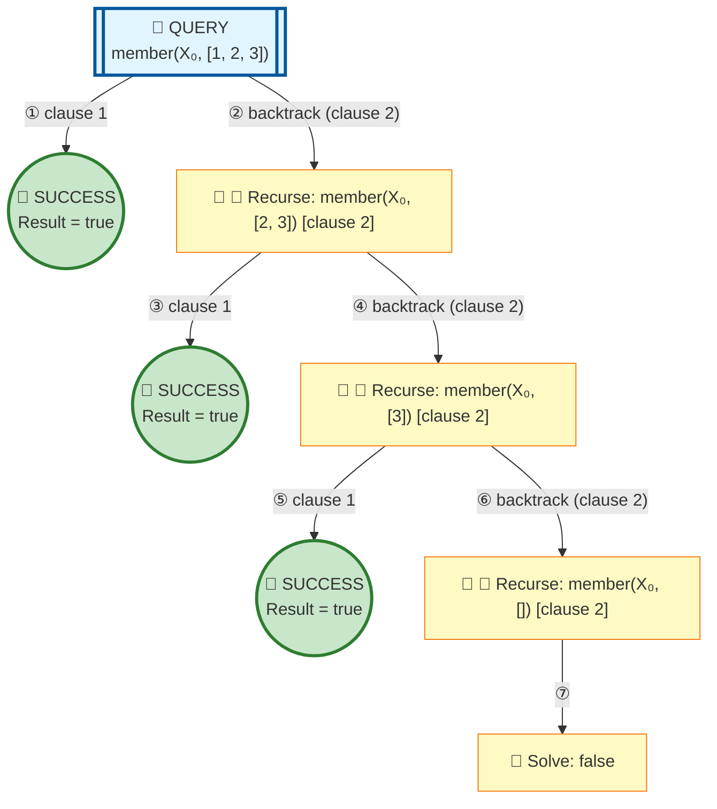

# Prolog Execution Tree: member(X, [1,2,3])

## Query

```prolog
member(X, [1,2,3])
```

## Clauses Defined

1. `member(X, [X|_])`
2. `member(X, [_|T]) :- member(X, T)`

## Search Tree Visualization



### Legend

- 🎯 **Blue**: Initial query
- 🔄 **Yellow**: Currently solving goal
- ⏸️ **Gray**: Pending goals (waiting for current goal to complete)
- ✅ **Green**: Solved goal with binding
- 🎉 **Green**: Final success
- **Solid arrows**: Active execution flow
- **Dashed arrows**: Goals queued for later
- **Double arrows (green)**: Pending goal becomes active

## Step-by-Step Execution

### Step 1

**Goal:** `true`

**Action:** Solving true

### Step 2

**Goal:** `member(X₀,[2,3])`

**Action:** Backtracking: member(X₀,[2,3])

### Step 3

**Goal:** `true`

**Action:** Solving true

### Step 4

**Goal:** `member(X₀,[3])`

**Action:** Solving member(X₀,[3])

### Step 5

**Goal:** `true`

**Action:** Solving true

### Step 6

**Goal:** `member(X₀,[])`

**Action:** Solving member(X₀,[])

### Step 7

**Goal:** `false`

**Action:** Solving false


## Final Answer

Query succeeded with no bindings.