# Prolog Execution Tree: t(1+0+1, C)

## Query

```prolog
t(1+0+1, C)
```

## Clauses Defined

**Line 1:** `t(0+1, 1+0)`
**Line 2:** `t(X+0+1, X+1+0)`
**Line 3:** `t(X+1+1, Z) :- t(X+1, X1), t(X1+1, Z)`

## Search Tree Visualization

```mermaid
graph TD

%% Nodes
A[["🎯 QUERY<br/>t(1+0+1, C)"]]
B["📦 Match Clause 3<br/>t(X+1+1, Z)<br/><br/>Unifications:<br/>• C = 1+1+0"]
C("✅ Solved: C = 1+1+0")
D(("🎉 SUCCESS"))

%% Edges
A -->|"① try"| B
A -->|"② C = 1+1+0"| C
C -->|"③ all done"| D

%% Styles
style A fill:#e1f5ff,stroke:#01579b,stroke-width:3px
style B fill:#ffe0b2,stroke:#e65100
style C fill:#c8e6c9,stroke:#388e3c
style D fill:#c8e6c9,stroke:#2e7d32,stroke-width:3px
```



### Legend

- 🎯 **Blue**: Initial query
- 🔄 **Yellow**: Currently solving goal
- 📦 **Orange**: Clause match with unifications
- ⏸️ **Gray**: Pending goals (waiting for current goal to complete)
- ✅ **Green**: Solved goal with binding
- 🎉 **Green**: Final success
- **Solid arrows**: Active execution flow
- **Dashed arrows**: Goals queued for later
- **Double arrows (green)**: Pending goal becomes active

## Step-by-Step Execution

### Step 3

**Goal:** `true`

**Action:** Solving true


## Final Answer

Query succeeded with no bindings.