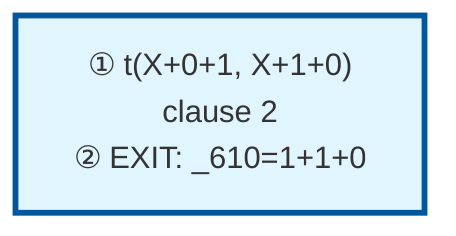

# Prolog Execution Trace: t(1+0+1, C)

## Query

```
t(1+0+1, C)
```

## Clause Definitions

| Line # | Clause |
|--------|--------|
| 1 | `t(0+1, 1+0)` |
| 2 | `t(X+0+1, X+1+0)` |
| 3 | `t(X+1+1, Z) :- t(X+1, X1), t(X1+1, Z)` |

## Execution Timeline

┌─ Step 1: CALL t(1+0+1,_610)
│  
│  Pattern Match:
│    Goal: t(1+0+1,_610)
│    Head: t(X+0+1, X+1+0)
│    ├─ X = 1
│  
│  Clause: t(X+0+1, X+1+0) [line 2] (fact)
└─

┌─ Step 2: EXIT t(1+0+1,1+1+0)
│  Bindings:
│    _610 = 1+1+0
│  Returns to: Step 1
└─


## Call Tree



## Final Answer

```
C = 1+1+0
```

_Showing first solution only._