# Prolog Execution Tree: t(1+0+1+1+1, C)

## Query

```prolog
t(1+0+1+1+1, C)
```

## Search Tree Visualization

```mermaid
graph TD

%% Nodes
A[["🎯 QUERY<br/>t(1+0+1+1+1, C₀)"]]
B["🔄 Solve: t(1+0+1+1, X1₀)"]
B2["⏸️ Pending: t(X1₀+1, C₀)"]
C["🔄 Solve: t(1+0+1, X1₁)"]
C2["⏸️ Pending: t(X1₁+1, X1₀)"]
D("✅ Solved: X1₁ = 1+1+0")
E["🔄 Solve: t(1+1+0+1, X1₀)"]
F("✅ Solved: X1₀ = 1+1+1+0")
G["🔄 Solve: t(1+1+1+0+1, C₀)"]
H("✅ Solved: C₀ = 1+1+1+1+0")
I(("🎉 SUCCESS"))

%% Edges
A -->|"①"| B
B -.->|"② queue"| B2
B -->|"③ recurse"| C
C -.->|"④ queue"| C2
C -->|"⑤ X1₁ = 1+1+0"| D
D -->|"⑥ done"| E
C2 ==>|"⑦ activate"| E
E -->|"⑧ X1₀ = 1+1+1+0"| F
F -->|"⑨ done"| G
B2 ==>|"⑩ activate"| G
G -->|"⑪ C₀ = 1+1+1+1+0"| H
H -->|"⑫ all done"| I

%% Styles
style A fill:#e1f5ff,stroke:#01579b,stroke-width:3px
style B fill:#fff9c4,stroke:#f57f17
style B2 fill:#e0e0e0,stroke:#616161
style C fill:#fff9c4,stroke:#f57f17
style C2 fill:#e0e0e0,stroke:#616161
style D fill:#c8e6c9,stroke:#388e3c
style E fill:#fff9c4,stroke:#f57f17
style F fill:#c8e6c9,stroke:#388e3c
style G fill:#fff9c4,stroke:#f57f17
style H fill:#c8e6c9,stroke:#388e3c
style I fill:#c8e6c9,stroke:#2e7d32,stroke-width:3px
linkStyle 1,3 stroke:#999,stroke-width:2px,stroke-dasharray:5
linkStyle 6,9 stroke:#4caf50,stroke-width:3px
```



### Legend

- 🎯 **Blue**: Initial query
- 🔄 **Yellow**: Currently solving goal
- ⏸️ **Gray**: Pending goals (waiting for current goal to complete)
- ✅ **Green**: Solved goal with binding
- 🎉 **Green**: Final success
- **Solid arrows**: Active execution flow
- **Dashed arrows**: Goals queued for later
- **Double arrows (green)**: Pending goal becomes active

## Step-by-Step Execution

### Step 1

**Goal:** `t(1+0+1+1,X1₀)`

**Action:** Solving t(1+0+1+1,X1₀)

### Step 3

**Goal:** `t(1+0+1,X1₁)`

**Action:** Solving t(1+0+1,X1₁)

**Clause matched:** `X1₁/1+1+0`

### Step 6

**Goal:** `t(1+1+0+1,X1₀)`

**Action:** Solving t(1+1+0+1,X1₀)

**Clause matched:** `X1₀/1+1+1+0`

### Step 9

**Goal:** `t(1+1+1+0+1,C₀)`

**Action:** Solving t(1+1+1+0+1,C₀)

**Clause matched:** `C₀/1+1+1+1+0`

### Step 12

**Goal:** `true`

**Action:** Solving true


## Final Answer

```prolog
C = 1+1+1+1+0
```

## Clauses Defined

1. `t(0+1, 1+0)`
2. `t(X+0+1, X+1+0)`
3. `t(X+1+1, Z) :- t(X+1, X1), t(X1+1, Z)`