# Prolog Trace: `append([1,2], [3], X)`

## Query

```prolog
append([1,2], [3], X)
```

## Execution Tree

```mermaid
flowchart TD

%% Nodes
node_0[["🎯 append(\lbrack 1,2\rbrack ,\lbrack 3\rbrack ,$X_{0"]]
node_1["🔄 append(\lbrack 2\rbrack ,\lbrack 3\rbrack ,$R_{0"]
node_2["🔄 append(\lbrack\rbrack ,\lbrack 3\rbrack ,$R_{1"]
node_3(("🎉 true"))

%% Edges
node_0 -->|"① $X_{0}$/\lbrack 1$|$$R_{0}$\rbrack "| node_1
node_1 -->|"② $R_{0}$/\lbrack 2$|$$R_{1}$\rbrack "| node_2
node_2 -->|"③"| node_3

%% Styles
style node_0 fill:#4A90D9,stroke:#333,stroke-width:2px
style node_1 fill:#F5A623,stroke:#333,stroke-width:2px
style node_2 fill:#F5A623,stroke:#333,stroke-width:2px
style node_3 fill:#7ED321,stroke:#333,stroke-width:2px
linkStyle 0 stroke:#333
linkStyle 1 stroke:#333
linkStyle 2 stroke:#333
```



## Legend

| Symbol | Meaning |
|--------|---------|
| 🎯 | Initial query |
| 🔄 | Currently solving |
| ⏸️ | Pending (queued) |
| ✅ | Solved |
| 🎉 | Success |
| → | Active execution |
| ⇢ | Queueing |
| ⇒ | Activation |

## Step-by-Step Execution

### Step 1

**Goal:** `append(\lbrack 2\rbrack ,\lbrack 3\rbrack ,$R_{0`

**Action:** Solving append(\lbrack 2\rbrack ,\lbrack 3\rbrack ,$R_{0

**Clause matched:** `$X_{0}$/\lbrack 1$|$$R_{0}$\rbrack `

### Step 2

**Goal:** `append(\lbrack\rbrack ,\lbrack 3\rbrack ,$R_{1`

**Action:** Solving append(\lbrack\rbrack ,\lbrack 3\rbrack ,$R_{1

**Clause matched:** `$R_{0}$/\lbrack 2$|$$R_{1}$\rbrack `

### Step 3

**Goal:** `true`

**Action:** Solving true


## Final Answer

**Result:** `$X_{0}$/\lbrack 1$|$$R_{0}$\rbrack , $X_{0}$/\lbrack 1$|$$R_{0}$\rbrack , $R_{0}$/\lbrack 2$|$$R_{1}$\rbrack `

## Clauses Used

_No clause information available._